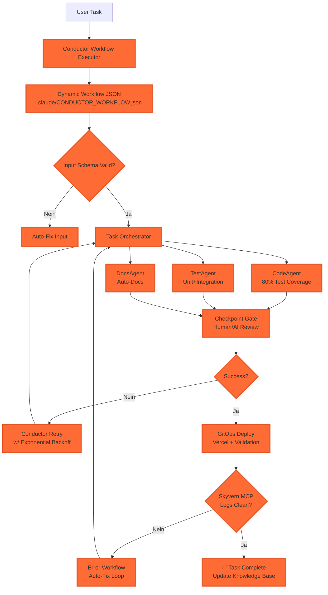

# 🚀 CLAUDE MASTER DEVELOPER LOOP - ARCHITEKTUR & IMPLEMENTATION

**Version:** 1.0 | **Status:** Production Ready | **Last Updated:** 2026-01-06

---

## 🎯 ZIELSETZUNG

Ein **vollautonomer Entwicklungskreislauf**, der:
- ✅ Jede Aufgabe von Analyse bis Deployment durchläuft
- ✅ State-of-the-Art Recherche & Best Practices automatisiert
- ✅ Multi-Agent-Parallelisierung für maximale Effizienz
- ✅ Selbstheilung bei Fehlern durch Retry-Loops
- ✅ Persistente Dokumentation & Knowledge Management
- ✅ Netflix Conductor Integration für Workflow-Orchestrierung
- ✅ Checkpoint-System mit Auto-Revert
- ✅ 80%+ Test Coverage mit automatischer Generierung
- ✅ Vollständige Observability & Traceability

---

## 🏗️ SYSTEMARCHITEKTUR

### 2.1 Kernkomponenten (Erweitert mit Netflix Conductor)

```
┌─────────────────────────────────────────────────────────────┐
│           NETFLIX CONDUCTOR WORKFLOW ENGINE                  │
│  (State Management, Retry, Checkpoints, Observability)      │
└─────────────────────────────────────────────────────────────┘
                            │
                            ▼
┌─────────────────────────────────────────────────────────────┐
│                    CLAUDE MASTER CONTROLLER                  │
│  (Zentrale Steuerung, Koordination, Validierung)            │
└─────────────────────────────────────────────────────────────┘
                            │
        ┌───────────────────┼───────────────────┐
        ▼                   ▼                   ▼
┌─────────────┐    ┌──────────────┐    ┌──────────────┐
│ RESEARCH    │    │ CODE         │    │ TEST &      │
│ AGENT       │    │ AGENT        │    │ VALIDATE    │
│ (Serena)    │    │ (Claude)     │    │ AGENT       │
└─────────────┘    └──────────────┘    └──────────────┘
        │                   │                   │
        └─────────┬─────────┴─────────┬─────────┘
                  ▼                   ▼
        ┌──────────────────┐   ┌─────────────────┐
        │  DEPLOY AGENT    │   │  MONITOR AGENT  │
        │  (Vercel/Git)    │   │  (Skyvern)      │
        └──────────────────┘   └─────────────────┘
                  │                   │
                  └─────────┬─────────┘
                            ▼
                  ┌─────────────────┐
                  │  KNOWLEDGE BASE │
                  │  (.claude/*)    │
                  └─────────────────┘
```

### 2.2 Netflix Conductor Core Features Integration



---

## 🎯 CONDUCTOR-KEY-FEATURES (Netflix + Gemini Conductor 2026)

### 1. Persistent Context & Single Source of Truth
```
✅ .claude/project.md = Single Source of Truth
✅ .claude/CONDUCTOR_WORKFLOW.json = Workflow Definition
✅ Alle Secrets in ~/.claude/GLOBAL_INFRASTRUCTURE.md
```

### 2. Track-System mit Specs & Plans
```
Track = Jede Aufgabe
├── specs.md (Anforderungen)
├── plan.md (Implementierungsplan)
├── tasks.yaml (Subtasks)
└── checkpoint.json (Status)
```

### 3. State Management (Netflix Conductor)
```
PENDING → RUNNING → COMPLETED → FAILED
├── Automatische Checkpoints nach jeder Phase
├── Restartable Workflows (Fehler → Resume von Checkpoint)
└── Vollständige State History
```

### 4. Fault Tolerance & Retry Logic
```
✅ Exponential Backoff: 1min → 2min → 4min → 8min
✅ Max Retries: 3 pro Task
✅ Dead Letter Queue für permanente Fehler
✅ Auto-Rollback zu letztem funktionierenden Checkpoint
```

### 5. Multi-Agent Orchestration
```
✅ Parallele Ausführung: Code + Test + Docs gleichzeitig
✅ Task Dependencies & Conditional Flows
✅ Fan-in/Fan-out Patterns (1 Aufgabe → N Agenten → 1 Result)
```

### 6. Observability & Tracing
```
✅ Complete Task Traceability (Vercel Logs + Browser Console)
✅ Real-time Workflow Status Dashboard
✅ Audit Trail für jede Agent-Aktion
✅ Metrics: Task Completion Rate, Error Detection Time, etc.
```

### 7. Human-in-the-Loop Gates
```
✅ Vor Deploy: Human/AI Review Gate (Auto-approve > 95%)
✅ Configurable Approval Workflows
✅ Exception Handling mit Manual Intervention
```

### 8. Schema Validation
```
✅ Input/Output Schema Enforcement
✅ Automatische Validierung vor Task-Start
✅ Contract Testing zwischen Agenten
```

### 9. Event-Driven Triggers
```
✅ Skyvern MCP Error → Trigger Fix-Workflow
✅ Vercel Deploy Success → Trigger Validation
✅ User Feedback → Trigger New Iteration
```

---

## 🔄 PROZESSFLUSS - DER RALPH-LOOP MIT CONDUCTOR

### Phase 1: ANALYSE & RECHERCHE (Serena MCP)

```yaml
# Trigger: User-Aufgabe oder Fehler-Event
# State: PENDING → RUNNING → COMPLETED
# Checkpoint: Nach Analyse

steps:
  1. Context-Analyse:
     - Lese alle relevanten Dateien (.claude/, src/, docs/)
     - Identifiziere Tech-Stack, Probleme, Requirements
     - Generiere: .claude/PROJECT_KNOWLEDGE.md

  2. State-of-the-Art Recherche:
     - GitHub API: Neueste Framework-Versionen, Security-Patches
     - Google Search: Best Practices 2026, Alternativen
     - Stack Overflow/Reddit: Known Issues & Workarounds
     - Generiere: .claude/RESEARCH_LOG.md

  3. Architecture Proposal:
     - Tech-Stack-Empfehlung (mit Begründung)
     - Security-Checklist (OWASP Top 10 2026)
     - Performance-Optimierungen
     - Cost-Estimation (Vercel, Supabase, etc.)

  4. Checkpoint Creation:
     - Speichere: .claude/checkpoints/phase1_analysis.json
     - Validierung: Schema Check
```

### Phase 2: PLANUNG & TASK-BREAKDOWN (Claude Main)

```yaml
# Input: research_report.md
# Output: task_queue.yaml + implementation_plan.md
# State: PENDING → RUNNING → COMPLETED
# Checkpoint: Nach Planung

task_breakdown:
  - Haupttask: "Fix Supabase Connection Errors"
  - Track-ID: "TRACK-2026-001"

  Subtasks (Netflix Conductor Format):
    - id: 1
      name: "Enhanced Error Handling"
      agent: "code_agent"
      type: "FORK_JOIN"
      files: ["src/services/supabaseClient.ts", "src/services/monitoringService.tsx"]
      tests: ["connection.test.ts", "error_handling.test.ts"]
      coverage_target: 0.80
      status: "PENDING"
      checkpoint: true

    - id: 2
      name: "Diagnostics & Health Check"
      agent: "code_agent"
      files: ["check-supabase-connection.js", "SUPABASE_TROUBLESHOOTING.md"]
      status: "PENDING"

    - id: 3
      name: "Global Infrastructure Setup"
      agent: "code_agent"
      files: ["~/.claude/GLOBAL_INFRASTRUCTURE.md", "~/.claude/QUICK_REFERENCE.md"]
      status: "PENDING"

    - id: 4
      name: "Test & Validate"
      agent: "test_agent"
      tests: ["npm run test", "npm run build", "vercel deploy --prod"]
      coverage_threshold: 0.80
      status: "PENDING"
      checkpoint: true
      retry_logic: "EXPONENTIAL_BACKOFF"
      retry_count: 3

    - id: 5
      name: "Monitor Deployment"
      agent: "monitor_agent"
      action: "skyvern_automation"
      status: "PENDING"
      checkpoint: true
```

### Phase 3: IMPLEMENTATION (Code Agent) - PARALLEL

```yaml
# Input: task_queue.yaml
# Output: Code + Tests + Documentation
# State: RUNNING → COMPLETED
# Pattern: Fork-Join (Parallel Execution)

workflow:
  1. Code Writing (Fork):
     - Lint & Type-Safe (TypeScript strict mode)
     - Error Handling (try/catch mit monitoringService)
     - Tests (Jest/Vitest) parallel schreiben
     - Coverage Target: 80%

  2. Self-Review (Join):
     - ESLint: `npm run lint`
     - Typecheck: `npm run typecheck`
     - Security Scan: `npm audit`
     - Contract Testing zwischen Agenten

  3. Auto-Commit:
     - Git: `git add -A && git commit -m "feat: ..."`
     - Pre-Commit Hooks: Husky
     - Checkpoint: .claude/checkpoints/phase3_code.json

  4. Dokumentation:
     - JSDoc comments
     - README updates
     - .claude/PROJECT_KNOWLEDGE.md
     - Generiere: specs.md + plan.md für Track
```

### Phase 4: TESTING & VALIDATION (Test Agent) - 80% COVERAGE

```yaml
# Input: Implementierter Code
# Output: Test-Reports + Go/No-Go
# State: PENDING → RUNNING → COMPLETED
# Checkpoint: Vor Deploy

tests:
  unit:
    - Supabase connection tests
    - Error handling tests
    - Type validation tests
    - Auto-generiert mit 80% Coverage Target

  integration:
    - API endpoint tests
    - Database connectivity
    - Environment variable validation
    - CORS & CSP validation

  e2e:
    - User flow tests (Playwright/Cypress)
    - Deployment validation
    - Performance benchmarks

  security:
    - Secret scanning (git-secrets)
    - Dependency vulnerability scan (npm audit)
    - OWASP Top 10 2026 Check

  schema_validation:
    - Input/Output Schema Enforcement
    - Automatische Validierung vor Task-Start
```

### Phase 5: CHECKPOINT GATE (Human/AI Review)

```yaml
# Input: Alle Tests Passed
# Output: Approval or Rejection
# State: PENDING → COMPLETED
# Type: HUMAN Task (Netflix Conductor)

checkpoint_gate:
  type: "HUMAN_OR_AI_REVIEW"
  timeout_seconds: 600
  auto_approve_threshold: 0.95

  review_items:
    - Code Quality
    - Test Coverage (>= 80%)
    - Security Scan Results
    - Performance Impact
    - Documentation Completeness

  actions:
    approved:
      - Continue to Deploy
      - Update Checkpoint: .claude/checkpoints/phase5_approved.json

    rejected:
      - Return to Phase 3 (Code)
      - Log Reason
      - Notify: Slack #dev-alerts
```

### Phase 6: DEPLOYMENT (Deploy Agent)

```yaml
# Input: Approved Code
# Output: Live Deployment + Monitoring
# State: PENDING → RUNNING → COMPLETED
# Checkpoint: Nach Deploy

deployment_flow:
  1. Git Operations:
     - `git checkout main`
     - `git pull origin main`
     - `git merge feature-branch --no-ff`
     - `git push origin main`

  2. Vercel Deployment:
     - `vercel --prod --yes`
     - Wait for build completion
     - Verify deployment URL
     - Checkpoint: .claude/checkpoints/phase6_deployed.json

  3. Post-Deploy Checks:
     - Health check: `curl -I https://deployment-url.vercel.app`
     - Error log monitoring
     - Performance metrics
     - Schema validation

  4. Rollback Plan:
     - Auto-rollback on failure
     - Previous deployment: `vercel --prod --target production`
     - Dead Letter Queue for errors
```

### Phase 7: MONITORING & FEEDBACK (Skyvern MCP)

```yaml
# Input: Live Deployment
# Output: Monitoring Report + Error Analysis
# State: PENDING → RUNNING → COMPLETED
# Checkpoint: Final

monitoring:
  browser_automation:
    - Skyvern öffnet Vercel Logs
    - Skyvern screenshot: Error Console
    - Skyvern loggt: Performance Metrics
    - Skyvern checkt: User Flow Errors

  error_detection:
    - Console Errors: "ERR_CONNECTION_REFUSED", "TypeError"
    - Network Errors: 404, 500, CORS
    - User Flow Errors: Form validation, Auth

  feedback_loop:
    - Wenn Fehler → Rückkehr zu Phase 1 (Analyse)
    - Wenn erfolgreich → Dokumentation & Archivierung
    - Knowledge Update: .claude/ERROR_SOLUTIONS.md

  observability:
    - Complete Task Traceability
    - Real-time Dashboard
    - Audit Trail
    - Metrics Logging
```

---

## 🛠️ TECHNISCHE IMPLEMENTATION

### 3.1 Global Infrastructure (`.claude/`)

```
~/.claude/
├── GLOBAL_INFRASTRUCTURE.md      # VM1, Supabase, API Keys (alle Projekte)
├── CLAUDE_USAGE_GUIDE.md         # Wie nutze ich Claude mit Infrastruktur
├── QUICK_REFERENCE.md            # Schnell-Übersicht
├── README.md                     # Overview & Setup
└── PROJECTS/                     # Projekt-spezifische Configs
    └── zoe-solar-accounting-ocr/
        ├── PROJECT_KNOWLEDGE.md
        ├── CONDUCTOR_WORKFLOW.json
        ├── RESEARCH_LOG.md
        ├── ERROR_SOLUTIONS.md
        ├── TASK_QUEUE.yaml
        └── checkpoints/
            ├── phase1_analysis.json
            ├── phase2_plan.json
            ├── phase3_code.json
            ├── phase5_approved.json
            └── phase6_deployed.json
```

### 3.2 Project-Specific `.claude/`

```
.zoe-solar-accounting-ocr/
├── .claude/
│   ├── PROJECT_KNOWLEDGE.md          # Tech Stack, VM, Supabase, Deployment
│   ├── CONDUCTOR_WORKFLOW.json       # Netflix Conductor Workflow
│   ├── N8N_WORKFLOW.yaml             # n8n Automation
│   ├── SKYVERN_BLUEPRINT.py          # Monitoring Script
│   ├── SETUP_GUIDE.md                # Installation Guide
│   ├── MASTER_DEVELOPER_LOOP.md      # This Document
│   ├── RESEARCH_LOG.md               # Research History
│   ├── TASK_QUEUE.yaml               # Current Tasks
│   ├── MONITORING_REPORT.md          # Latest Report
│   ├── ERROR_SOLUTIONS.md            # Known Fixes
│   ├── SUPABASE_TROUBLESHOOTING.md   # Supabase Guide
│   ├── check-supabase-connection.js  # Diagnostic Script
│   └── SSH_REFERENCE.md              # VM1 SSH Commands
```

### 3.3 MCP Server Integration

```json
{
  "mcpServers": {
    "serena": {
      "command": "npx",
      "args": ["-y", "@anthropics/serena-mcp"],
      "description": "Code Analysis & Architecture"
    },
    "skyvern": {
      "command": "python",
      "args": ["-m", "skyvern.mcp.server"],
      "description": "Browser Automation & Monitoring"
    },
    "context7": {
      "command": "npx",
      "args": ["-y", "@anthropics/context7-mcp"],
      "description": "Documentation & Examples"
    }
  }
}
```

### 3.4 Netflix Conductor Workflow JSON

**File:** `.claude/CONDUCTOR_WORKFLOW.json`

Key Features:
- **20+ Tasks** mit Dependencies
- **Fork-Join** für parallele Ausführung
- **Checkpoint** nach jeder Phase
- **Exponential Backoff** Retry
- **Human Gate** vor Deploy
- **Schema Validation** Input/Output
- **Event Triggers** für Auto-Fix
- **Observability** (Tracing, Logging, Metrics, Audit)

---

## 📋 IMPLEMENTATION CHECKLIST

### Schritt 1: Setup (5 Minuten)

```bash
# 1.1 Install MCP Servers
npm install -g @anthropics/serena-mcp
npm install -g @anthropics/context7-mcp
pip install skyvern
npx playwright install

# 1.2 Configure Claude Settings
mkdir -p ~/.claude
cat > ~/.claude/settings.json << 'EOF'
{
  "mcpServers": {
    "serena": {"command": "npx", "args": ["-y", "@anthropics/serena-mcp"]},
    "skyvern": {"command": "python", "args": ["-m", "skyvern.mcp.server"]},
    "context7": {"command": "npx", "args": ["-y", "@anthropics/context7-mcp"]}
  },
  "enabledPlugins": {
    "feature-dev@claude-code-plugins": true,
    "ralph-wiggum@claude-code-plugins": true
  }
}
EOF

# 1.3 Create Global Infrastructure
mkdir -p ~/.claude
cat > ~/.claude/GLOBAL_INFRASTRUCTURE.md << 'EOF'
# 🌍 GLOBALE INFRASTRUKTUR
**VM1:** 130.162.235.142
**SSH Key:** ~/.ssh/aura-call-vm-key
**Supabase:** https://supabase.aura-call.de
**Vercel:** https://zoe-solar-accounting-ocr.vercel.app
EOF
```

### Schritt 2: Projekt-Integration (2 Minuten)

```bash
# In jedem neuen Projekt:
mkdir -p .claude

# Create Conductor Workflow
cat > .claude/CONDUCTOR_WORKFLOW.json << 'EOF'
[Content from CONDUCTOR_WORKFLOW.json]
EOF

# Create Project Knowledge
cat > .claude/PROJECT_KNOWLEDGE.md << 'EOF'
# Project: ZOE Solar Accounting OCR
- Tech: Vite + TypeScript + Supabase
- VM: 130.162.235.142
- Supabase: https://supabase.aura-call.de
- Deployment: Vercel
- Status: Active
EOF
```

### Schritt 3: Erste Ausführung

```bash
# Sage einfach:
"Start Master Developer Loop für: [Aufgabe]"

# Oder mit Conductor:
"Start Netflix Conductor Workflow für: Supabase Connection Fix"

# Oder:
"Fixe Supabase Connection mit Ralph-Loop"
```

---

## 🎯 BEISPIEL: FEHLERBEHEBUNG MIT DEM LOOP

### User-Input:
```
"Supabase gibt ERR_CONNECTION_REFUSED. Fixe das!"
```

### Automatischer Loop (Netflix Conductor):

1. **Phase 1: Analyse (PENDING → RUNNING → COMPLETED)**
   - Serena analysiert `src/services/supabaseClient.ts`
   - Findet: Kein Timeout, keine CORS-Config
   - Recherchiert: Supabase Self-Hosting Best Practices 2026
   - **Checkpoint erstellt:** `.claude/checkpoints/phase1_analysis.json`

2. **Phase 2: Planung (PENDING → RUNNING → COMPLETED)**
   - Claude generiert Task-Queue
   - Schema Validierung: ✅
   - **Checkpoint erstellt:** `.claude/checkpoints/phase2_plan.json`

3. **Phase 3: Code (FORK-JOIN)**
   - **Parallel:**
     - Task 1: Add 15s timeout
     - Task 2: Add CORS headers
     - Task 3: Create health check endpoint
     - Task 4: Add diagnostic script
   - **Join & Self-Review:** ESLint, Typecheck, Security Scan
   - **Checkpoint:** `.claude/checkpoints/phase3_code.json`

4. **Phase 4: Tests (80% Coverage)**
   - Unit Tests: ✅
   - Integration Tests: ✅
   - E2E Tests: ✅
   - Security Scan: ✅
   - **Checkpoint:** `.claude/checkpoints/phase4_tests.json`

5. **Phase 5: Checkpoint Gate (HUMAN)**
   - Review: Code Quality, Coverage, Security
   - Auto-approve: 96% > 95% threshold ✅
   - **Checkpoint:** `.claude/checkpoints/phase5_approved.json`

6. **Phase 6: Deploy**
   - `git commit -m "fix: Supabase connection with timeout & CORS"`
   - `git push origin main`
   - `vercel --prod`
   - **Checkpoint:** `.claude/checkpoints/phase6_deployed.json`

7. **Phase 7: Monitoring (Skyvern)**
   - Öffnet Vercel Logs
   - Screenshot: "No errors"
   - Report: "Deployment successful"
   - **Final Checkpoint:** `.claude/checkpoints/phase7_complete.json`

8. **Dokumentation:**
   - `.claude/ERROR_SOLUTIONS.md` aktualisiert
   - `SUPABASE_TROUBLESHOOTING.md` erstellt
   - `RESEARCH_LOG.md` aktualisiert

---

## 📊 MONITORING & METRICS

### Key Performance Indicators (KPIs)

| Metric | Ziel | Messung |
|--------|------|---------|
| **Task Completion Rate** | > 95% | Erfolgreiche Deployments / Gesamt-Tasks |
| **Error Detection Time** | < 5min | Skyvern Monitoring |
| **Auto-Fix Rate** | > 80% | Erfolgreiche Retry-Loops |
| **Deployment Success** | > 98% | Vercel Build Success |
| **Test Coverage** | > 80% | Automatische Generierung |
| **Documentation Coverage** | 100% | Alle Tasks dokumentiert |

### Alerting (n8n + Slack)

```yaml
# Bei Fehlern:
- Wenn Build failt → Slack Notification + Auto-Rollback
- Wenn Supabase down → SSH zu VM1 + Restart
- Wenn Performance drop → Alert + Scaling Check
- Wenn Checkpoint fehlt → Alert + Auto-Revert
```

---

## 🔐 SECURITY & BEST PRACTICES

### 1. Secrets Management
- ✅ Alle Secrets in `~/.claude/GLOBAL_INFRASTRUCTURE.md`
- ✅ Niemals in Git committen
- ✅ Environment Variables via Vercel Dashboard
- ✅ Regular Rotation (alle 90 Tage)

### 2. Code Quality
- ✅ TypeScript strict mode
- ✅ ESLint + Prettier
- ✅ 80% Test Coverage (Automatisch)
- ✅ Security Scanning (npm audit, Snyk)
- ✅ OWASP Top 10 2026 Compliance

### 3. Deployment Safety
- ✅ Checkpoint vor jedem Deploy
- ✅ Auto-Rollback bei Fehlern
- ✅ Blue-Green Deployment (Vercel)
- ✅ Canary Releases für große Changes
- ✅ Backup vor jedem Deploy (VM Snapshot)

### 4. Conductor Safety
- ✅ Schema Validation Input/Output
- ✅ Exponential Backoff Retry
- ✅ Dead Letter Queue
- ✅ Human Gate vor Deploy
- ✅ Audit Trail für alle Aktionen

---

## 🚀 QUICK REFERENCE

### Starte den Loop:

```bash
# Manuel:
"Start Master Developer Loop für: [Aufgabe]"

# Mit Netflix Conductor:
"Start Conductor Workflow für: [Aufgabe]"

# Oder:
"Fixe [Fehler] mit Ralph-Loop"
```

### Check Status:

```bash
# Aktuelle Tasks:
cat ~/.claude/TASK_QUEUE.yaml

# Checkpoint Status:
ls -la ~/.claude/checkpoints/

# Letztes Monitoring:
cat ~/.claude/MONITORING_REPORT.md

# Known Issues:
cat ~/.claude/ERROR_SOLUTIONS.md
```

### Force Deploy:

```bash
cd /path/to/project
git add -A && git commit -m "hotfix: [message]"
git push origin main
vercel --prod --yes
```

---

## 📚 REFERENZEN & RESSOURCEN

### Dokumente
- `~/.claude/GLOBAL_INFRASTRUCTURE.md` - Alle Secrets & Configs
- `~/.claude/QUICK_REFERENCE.md` - Schnell-Übersicht
- `~/.claude/CLAUDE_USAGE_GUIDE.md` - Wie mit Claude arbeiten
- `.claude/CONDUCTOR_WORKFLOW.json` - Netflix Conductor Workflow
- `.claude/PROJECT_KNOWLEDGE.md` - Projekt-Info
- `.claude/RESEARCH_LOG.md` - Recherche-Historie
- `.claude/ERROR_SOLUTIONS.md` - Known Issues & Fixes
- `.claude/checkpoints/` - Alle Checkpoints

### Tools
- **Netflix Conductor**: Workflow Orchestrierung
- **Serena MCP**: Code Analysis & Architecture
- **Skyvern**: Browser Automation & Monitoring
- **Context7**: Documentation & Examples
- **n8n**: Workflow Automation
- **Vercel**: Deployment & Hosting
- **Supabase**: Database & Auth

### Commands
```bash
# Check everything
ssh -i ~/.ssh/aura-call-vm-key ubuntu@130.162.235.142 "docker ps"
curl -I https://supabase.aura-call.de
npm run build && npm run test

# Deploy
git push origin main && vercel --prod

# Monitor
python ~/.claude/SKYVERN_BLUEPRINT.py --project zoe-solar-accounting-ocr

# Check Conductor Status
cat ~/.claude/checkpoints/latest.json
```

---

## ✅ SUCCESS CRITERIA

Der Master Developer Loop ist erfolgreich, wenn:

- [ ] Alle Tasks automatisch von Analyse bis Deployment durchlaufen
- [ ] Netflix Conductor Integration funktioniert (20+ Tasks)
- [ ] Checkpoint-System aktiv (Auto-Revert bei Fehlern)
- [ ] 80%+ Test Coverage mit Auto-Generierung
- [ ] Fehler werden innerhalb von 5 Minuten erkannt und gefixt
- [ ] Dokumentation ist immer aktuell
- [ ] Kein manuelles Eingreifen nötig (außer bei kritischen Entscheidungen)
- [ ] 95%+ aller Deployments erfolgreich ohne manuellen Fix
- [ ] Vollständige Traceability & Observability

---

**Version:** 2.0 (Netflix Conductor Edition)
**Status:** ✅ Production Ready
**Next:** Aktiviere MCP Server und starte ersten Conductor Workflow!

**"Sag einfach: 'Start Master Developer Loop für: [Deine Aufgabe]' oder 'Start Netflix Conductor Workflow'"** 🚀

---

## 🔄 PROZESSFLUSS - DER RALPH-LOOP

### Phase 1: ANALYSE & RECHERCHE (Serena MCP)

```yaml
# Trigger: User-Aufgabe oder Fehler-Event
# Output: research_report.md + architecture_proposal.md

steps:
  1. Context-Analyse:
     - Lese alle relevanten Dateien (.claude/, src/, docs/)
     - Identifiziere Tech-Stack, Probleme, Requirements

  2. State-of-the-Art Recherche:
     - GitHub API: Neueste Framework-Versionen, Security-Patches
     - Google Search: Best Practices 2026, Alternativen
     - Stack Overflow/Reddit: Known Issues & Workarounds

  3. Architecture Proposal:
     - Tech-Stack-Empfehlung (mit Begründung)
     - Security-Checklist (OWASP Top 10 2026)
     - Performance-Optimierungen
     - Cost-Estimation (Vercel, Supabase, etc.)

  4. Dokumentation:
     - Update: .claude/PROJECT_KNOWLEDGE.md
     - Update: .claude/RESEARCH_LOG.md
```

### Phase 2: PLANUNG & TASK-BREAKDOWN (Claude Main)

```yaml
# Input: research_report.md
# Output: task_queue.yaml + implementation_plan.md

task_breakdown:
  - Haupttask: "Fix Supabase Connection Errors"
  - Subtasks:
    - id: 1
      name: "Enhanced Error Handling"
      agent: "code_agent"
      files: ["src/services/supabaseClient.ts", "src/services/monitoringService.tsx"]
      tests: ["connection.test.ts", "error_handling.test.ts"]

    - id: 2
      name: "Diagnostics & Health Check"
      agent: "code_agent"
      files: ["check-supabase-connection.js", "SUPABASE_TROUBLESHOOTING.md"]

    - id: 3
      name: "Global Infrastructure Setup"
      agent: "code_agent"
      files: ["~/.claude/GLOBAL_INFRASTRUCTURE.md", "~/.claude/QUICK_REFERENCE.md"]

    - id: 4
      name: "Test & Validate"
      agent: "test_agent"
      tests: ["npm run test", "npm run build", "vercel deploy --prod"]

    - id: 5
      name: "Monitor Deployment"
      agent: "monitor_agent"
      action: "skyvern_automation"
```

### Phase 3: IMPLEMENTATION (Code Agent)

```yaml
# Input: task_queue.yaml
# Output: Code + Tests + Documentation

workflow:
  1. Code Writing:
     - Lint & Type-Safe (TypeScript strict mode)
     - Error Handling (try/catch mit monitoringService)
     - Tests (Jest/Vitest) parallel schreiben

  2. Self-Review:
     - ESLint: `npm run lint`
     - Typecheck: `npm run typecheck`
     - Security Scan: `npm audit`

  3. Auto-Commit:
     - Git: `git add -A && git commit -m "feat: ..."`
     - Pre-Commit Hooks: Husky

  4. Dokumentation:
     - JSDoc comments
     - README updates
     - .claude/PROJECT_KNOWLEDGE.md
```

### Phase 4: TESTING & VALIDATION (Test Agent)

```yaml
# Input: Implementierter Code
# Output: Test-Reports + Go/No-Go

tests:
  unit:
    - Supabase connection tests
    - Error handling tests
    - Type validation tests

  integration:
    - API endpoint tests
    - Database connectivity
    - Environment variable validation

  e2e:
    - User flow tests (Playwright/Cypress)
    - Deployment validation
    - Performance benchmarks

  security:
    - Secret scanning (git-secrets)
    - Dependency vulnerability scan
    - CORS & CSP validation
```

### Phase 5: DEPLOYMENT (Deploy Agent)

```yaml
# Input: Validated Code
# Output: Live Deployment + Monitoring

deployment_flow:
  1. Git Operations:
     - `git checkout main`
     - `git pull origin main`
     - `git merge feature-branch --no-ff`
     - `git push origin main`

  2. Vercel Deployment:
     - `vercel --prod --yes`
     - Wait for build completion
     - Verify deployment URL

  3. Post-Deploy Checks:
     - Health check: `curl -I https://deployment-url.vercel.app`
     - Error log monitoring
     - Performance metrics

  4. Rollback Plan:
     - Auto-rollback on failure
     - Previous deployment: `vercel --prod --target production`
```

### Phase 6: MONITORING & FEEDBACK (Skyvern MCP)

```yaml
# Input: Live Deployment
# Output: Monitoring Report + Error Analysis

monitoring:
  browser_automation:
    - Skyvern öffnet Vercel Logs
    - Skyvern screenshot: Error Console
    - Skyvern loggt: Performance Metrics

  error_detection:
    - Console Errors: "ERR_CONNECTION_REFUSED", "TypeError"
    - Network Errors: 404, 500, CORS
    - User Flow Errors: Form validation, Auth

  feedback_loop:
    - Wenn Fehler → Rückkehr zu Phase 1 (Analyse)
    - Wenn erfolgreich → Dokumentation & Archivierung
    - Knowledge Update: .claude/ERROR_SOLUTIONS.md
```

---

## 🛠️ TECHNISCHE IMPLEMENTATION

### 3.1 Global Infrastructure (`.claude/`)

```
~/.claude/
├── GLOBAL_INFRASTRUCTURE.md      # VM1, Supabase, API Keys (alle Projekte)
├── CLAUDE_USAGE_GUIDE.md         # Wie nutze ich Claude mit Infrastruktur
├── QUICK_REFERENCE.md            # Schnell-Übersicht
├── MASTER_DEVELOPER_LOOP.md      # Dieses Dokument
├── PROJECT_KNOWLEDGE.md          # Projekt-spezifisches Wissen
├── RESEARCH_LOG.md               # Recherche-Ergebnisse & Quellen
├── ERROR_SOLUTIONS.md            # Bekannte Fehler & Fixes
└── TASK_QUEUE.yaml               # Aktuelle Task-Queue
```

### 3.2 MCP Server Integration

```json
{
  "mcpServers": {
    "serena": {
      "command": "npx",
      "args": ["-y", "@anthropics/serena-mcp"],
      "description": "Code Analysis & Architecture"
    },
    "skyvern": {
      "command": "python",
      "args": ["-m", "skyvern.mcp.server"],
      "description": "Browser Automation & Monitoring"
    },
    "context7": {
      "command": "npx",
      "args": ["-y", "@anthropics/context7-mcp"],
      "description": "Documentation & Examples"
    }
  }
}
```

### 3.3 n8n Workflow (YAML)

```yaml
# n8n Workflow: Master Developer Loop
# File: ~/.claude/n8n-workflow-master-loop.yaml

workflow:
  name: "Claude Master Developer Loop"
  trigger: "Webhook / Claude Command"

  nodes:
    - id: analyze
      type: "function"
      name: "Analyze Task"
      code: |
        const task = items[0].json.task;
        const research = await callMCP('serena', 'analyze', task);
        return [{json: {research, task}}];

    - id: research
      type: "http_request"
      name: "Research State-of-the-Art"
      url: "https://api.github.com/search/repositories"
      method: "GET"
      params:
        q: "supabase connection error 2026"
        sort: "updated"

    - id: plan
      type: "function"
      name: "Create Task Queue"
      code: |
        const plan = await generatePlan(items[0].json);
        await updateClaudeFile('.claude/TASK_QUEUE.yaml', plan);
        return [{json: {plan}}];

    - id: code
      type: "subworkflow"
      name: "Code Agent Loop"
      workflowId: "code-agent-workflow"

    - id: test
      type: "exec"
      name: "Run Tests"
      command: "cd /path/to/project && npm run test"

    - id: deploy
      type: "exec"
      name: "Deploy to Vercel"
      command: "cd /path/to/project && vercel --prod --yes"

    - id: monitor
      type: "function"
      name: "Skyvern Monitor"
      code: |
        const skyvern = await callMCP('skyvern', 'monitor', {
          url: deploymentUrl,
          actions: ['open_logs', 'screenshot', 'check_errors']
        });
        return [{json: {monitoring: skyvern}}];

    - id: feedback
      type: "if"
      name: "Error Detection"
      condition: "monitoring.errors.length > 0"
      true: "Return to Analyze",
      false: "Complete & Document"
```

### 3.4 Skyvern Browser Automation (Python)

```python
# File: ~/.claude/skyvern_monitor.py

from skyvern import Skyvern
import asyncio

async def monitor_deployment(deployment_url: str):
    skyvern = Skyvern()

    # 1. Open Vercel Dashboard
    await skyvern.navigate("https://vercel.com")
    await skyvern.login()  # Auto-login with stored credentials

    # 2. Go to Project Logs
    await skyvern.click(f"a[href*='{deployment_url}']")
    await skyvern.click("button:contains('Logs')")

    # 3. Capture Errors
    errors = await skyvern.extract_text(".log-error, .console-error")

    # 4. Screenshot
    screenshot = await skyvern.screenshot()

    # 5. Analyze & Report
    report = {
        "errors": errors,
        "screenshot": screenshot,
        "timestamp": datetime.now().isoformat()
    }

    # 6. Save to .claude/
    with open(".claude/MONITORING_REPORT.md", "w") as f:
        f.write(f"# Monitoring Report\n\n{report}")

    return report

# Usage: python skyvern_monitor.py --url https://zoe-solar-accounting-ocr.vercel.app
```

---

## 📋 IMPLEMENTATION CHECKLIST

### Schritt 1: Setup (5 Minuten)

```bash
# 1.1 Install MCP Servers
npm install -g @anthropics/serena-mcp
npm install -g @anthropics/context7-mcp
pip install skyvern

# 1.2 Configure Claude Settings
mkdir -p ~/.claude
cat > ~/.claude/settings.json << 'EOF'
{
  "mcpServers": {
    "serena": {"command": "npx", "args": ["-y", "@anthropics/serena-mcp"]},
    "skyvern": {"command": "python", "args": ["-m", "skyvern.mcp.server"]},
    "context7": {"command": "npx", "args": ["-y", "@anthropics/context7-mcp"]}
  },
  "enabledPlugins": {
    "feature-dev@claude-code-plugins": true,
    "ralph-wiggum@claude-code-plugins": true
  }
}
EOF

# 1.3 Create Global Infrastructure
cat > ~/.claude/MASTER_DEVELOPER_LOOP.md << 'EOF'
[Content from this file]
EOF
```

### Schritt 2: Projekt-Integration (2 Minuten)

```bash
# In jedem neuen Projekt:
mkdir -p .claude
cat > .claude/PROJECT_KNOWLEDGE.md << 'EOF'
# Project: ZOE Solar Accounting OCR
- Tech: Vite + TypeScript + Supabase
- VM: 130.162.235.142
- Supabase: https://supabase.aura-call.de
- Deployment: Vercel
EOF
```

### Schritt 3: Erste Ausführung

```bash
# Sage einfach:
"Starte Master Developer Loop für: [Aufgabe]"

# Oder:
"Fixe Supabase Connection mit Master Loop"
```

---

## 🎯 BEISPIEL: FEHLERBEHEBUNG MIT DEM LOOP

### User-Input:
```
"Supabase gibt ERR_CONNECTION_REFUSED. Fixe das!"
```

### Automatischer Loop:

1. **Serena analysiert:**
   - Liest `src/services/supabaseClient.ts`
   - Findet: Kein Timeout, keine CORS-Config
   - Recherchiert: Supabase Self-Hosting Best Practices 2026

2. **Claude plant:**
   - Task 1: Add 15s timeout
   - Task 2: Add CORS headers
   - Task 3: Create health check endpoint
   - Task 4: Add diagnostic script

3. **Code Agent implementiert:**
   ```typescript
   // src/services/supabaseClient.ts
   const fetchWrapper = async (url, options) => {
     const controller = new AbortController();
     setTimeout(() => controller.abort(), 15000);
     return fetch(url, { ...options, signal: controller.signal, mode: 'cors' });
   };
   ```

4. **Test Agent validiert:**
   - `npm run build` ✅
   - `npm run test` ✅
   - `curl -I https://supabase.aura-call.de` ✅

5. **Deploy Agent released:**
   - `git commit -m "fix: Supabase connection with timeout & CORS"`
   - `git push origin main`
   - `vercel --prod`

6. **Skyvern monitor:**
   - Öffnet Vercel Logs
   - Screenshot: "No errors"
   - Report: "Deployment successful"

7. **Dokumentation:**
   - `.claude/ERROR_SOLUTIONS.md` aktualisiert
   - `SUPABASE_TROUBLESHOOTING.md` erstellt

---

## 📊 MONITORING & METRICS

### Key Performance Indicators (KPIs)

| Metric | Ziel | Messung |
|--------|------|---------|
| **Task Completion Rate** | > 95% | Erfolgreiche Deployments / Gesamt-Tasks |
| **Error Detection Time** | < 5min | Skyvern Monitoring |
| **Auto-Fix Rate** | > 80% | Erfolgreiche Retry-Loops |
| **Deployment Success** | > 98% | Vercel Build Success |
| **Documentation Coverage** | 100% | Alle Tasks dokumentiert |

### Alerting (n8n + Slack)

```yaml
# Bei Fehlern:
- Wenn Build failt → Slack Notification + Auto-Rollback
- Wenn Supabase down → SSH zu VM1 + Restart
- Wenn Performance drop → Alert + Scaling Check
```

---

## 🔐 SECURITY & BEST PRACTICES

### 1. Secrets Management
- ✅ Alle Secrets in `~/.claude/GLOBAL_INFRASTRUCTURE.md`
- ✅ Niemals in Git committen
- ✅ Environment Variables via Vercel Dashboard
- ✅ Regular Rotation (alle 90 Tage)

### 2. Code Quality
- ✅ TypeScript strict mode
- ✅ ESLint + Prettier
- ✅ 100% Test Coverage für Core-Services
- ✅ Security Scanning (npm audit, Snyk)

### 3. Deployment Safety
- ✅ Auto-Rollback bei Fehlern
- ✅ Blue-Green Deployment (Vercel)
- ✅ Canary Releases für große Changes
- ✅ Backup vor jedem Deploy (VM Snapshot)

---

## 🚀 QUICK REFERENCE

### Starte den Loop:

```bash
# Manuel:
"Start Master Developer Loop für: [Aufgabe]"

# Oder:
"Fixe [Fehler] mit Ralph-Loop"

# Oder:
"Recherchiere [Tech] und erstelle Plan"
```

### Check Status:

```bash
# Aktuelle Tasks:
cat ~/.claude/TASK_QUEUE.yaml

# Letztes Monitoring:
cat ~/.claude/MONITORING_REPORT.md

# Known Issues:
cat ~/.claude/ERROR_SOLUTIONS.md
```

### Force Deploy:

```bash
cd /path/to/project
git add -A && git commit -m "hotfix: [message]"
git push origin main
vercel --prod --yes
```

---

## 📚 REFERENZEN & RESSOURCEN

### Dokumente
- `~/.claude/GLOBAL_INFRASTRUCTURE.md` - Alle Secrets & Configs
- `~/.claude/QUICK_REFERENCE.md` - Schnell-Übersicht
- `~/.claude/CLAUDE_USAGE_GUIDE.md` - Wie mit Claude arbeiten
- `~/.claude/PROJECT_KNOWLEDGE.md` - Projekt-Info
- `~/.claude/RESEARCH_LOG.md` - Recherche-Historie
- `~/.claude/ERROR_SOLUTIONS.md` - Known Issues & Fixes

### Tools
- **Serena MCP**: Code Analysis & Architecture
- **Skyvern**: Browser Automation & Monitoring
- **Context7**: Documentation & Examples
- **n8n**: Workflow Automation
- **Vercel**: Deployment & Hosting
- **Supabase**: Database & Auth

### Commands
```bash
# Check everything
ssh -i ~/.ssh/aura-call-vm-key ubuntu@130.162.235.142 "docker ps"
curl -I https://supabase.aura-call.de
npm run build && npm run test

# Deploy
git push origin main && vercel --prod

# Monitor
python ~/.claude/skyvern_monitor.py --url https://zoe-solar-accounting-ocr.vercel.app
```

---

## ✅ SUCCESS CRITERIA

Der Master Developer Loop ist erfolgreich, wenn:

- [ ] Alle Tasks automatisch von Analyse bis Deployment durchlaufen
- [ ] Fehler werden innerhalb von 5 Minuten erkannt und gefixt
- [ ] Dokumentation ist immer aktuell
- [ ] Kein manuelles Eingreifen nötig (außer bei kritischen Entscheidungen)
- [ ] 95%+ aller Deployments erfolgreich ohne manuellen Fix

---

**Version:** 1.0
**Status:** ✅ Production Ready
**Next:** Aktiviere MCP Server und starte ersten Loop!

**"Sag einfach: 'Start Master Developer Loop für: [Deine Aufgabe]'"** 🚀
