# 🚀 CLAUDE MASTER DEVELOPER LOOP - ARCHITEKTUR & IMPLEMENTATION

**Version:** 2.2 | **Status:** Production Ready | **Last Updated:** 2026-01-06

**🎯 NEW:** Full Uncensored Workflow with Big Pickle Handover + Vision Quality Gate + Auto-Swarm

---

## 🎯 ZIELSETZUNG

Ein **vollautonomer Entwicklungskreislauf**, der:
- ✅ Jede Aufgabe von Analyse bis Deployment durchläuft
- ✅ State-of-the-Art Recherche & Best Practices automatisiert
- ✅ **Multi-Agent-Parallelisierung** (Claude + Gemini CLI + Conductor) für maximale Effizienz
- ✅ Selbstheilung bei Fehlern durch Retry-Loops
- ✅ Persistente Dokumentation & Knowledge Management
- ✅ Netflix Conductor Integration für Workflow-Orchestrierung
- ✅ Checkpoint-System mit Auto-Revert
- ✅ 80%+ Test Coverage mit automatischer Generierung
- ✅ Vollständige Observability & Traceability
- ✅ **UNCENSORED CODE GENERATION** via Big Pickle Handover
- ✅ **VISUAL QUALITY GATE** via SiliconFlow Vision API
- ✅ **AUTO-SWARM**: Jeder Coding Task = Automatischer Parallel-Execution

**🎯 EIN BEFEHL FÜR ALLES:** `npx claude "Master Loop für: [Aufgabe]"`

---

## 🎯 **NEUE SYSTEM REGEL: PARALLELER AGENTEN-SCHWARM** (MANDATORY)

**Ab sofort: JEDER Coding Task startet automatisch den kompletten Schwarm!**

### 🚀 AUTO-SWARM TRIGGER (100% Automatisch)

**Claude erkennt automatisch und startet:**

```
🟢 "Baue X" → AUTO-SWARM
🟢 "Fix Y" → AUTO-SWARM
🟢 "Create Z" → AUTO-SWARM
🟢 "Add Feature" → AUTO-SWARM
🟢 "Deploy" → AUTO-SWARM
```

### 🤖 PARALLELE AGENTEN (Gleichzeitige Ausführung)

```
┌─────────────────────────────────────────────────────────────┐
│  🟢 CLAUDE: Planning & Architecture (Analyse)              │
│  🔵 GEMINI CLI: Code Generation (Parallel)                 │
│  🟡 CONDUCTOR: Workflow Management (Tracks)                │
│  🟣 BIG PICKLE: Uncensored Fallback (Auto-Handover)        │
│  🎨 VISION GATE: UI/UX Quality Check (Auto-Fix)            │
│  🚀 DEPLOY: Vercel Live (Auto)                              │
└─────────────────────────────────────────────────────────────┘
```

### ⚡ PARALLEL EXECUTION FLOW

```javascript
// Auto-Swarm wird bei JEDEM Coding Task gestartet

async function masterDeveloperSwarm(task) {

  // 1. AUTO-DETECT: Ist das ein Coding Task?
  if (isCodingTask(task)) {
    console.log('🟢 AUTO-SWARM AKTIVIERT');

    // 2. Google Conductor Track erstellen (AUTO)
    const track = await conductor.newTrack(task);

    // 3. PARALLEL AGENTS (Gleichzeitig!)
    const [claudePlan, geminiCode, conductorWorkflow] = await Promise.all([
      claude.analyze(task),           // Phase 1: Analyse
      geminiCLI.generateCode(task),   // Phase 2: Code (Gemini)
      conductor.execute(track)        // Phase 3: Workflow
    ]);

    // 4. Merge + Tests
    const merged = await mergeResults(claudePlan, geminiCode);
    const tests = await runTests(merged);

    // 5. Vision Gate (Auto)
    const vision = await visionQualityGate(merged);
    if (vision.score < 8.5) {
      await autoFix(vision.feedback);
      await reDeploy();
    }

    // 6. Deploy (Auto)
    await deployToVercel();

    return {
      status: '✅ COMPLETE',
      url: 'https://app.vercel.app',
      vision: vision.score,
      source: 'Swarm (Claude + Gemini + Conductor)'
    };
  }

  // Kein Swarm → Direkte Antwort
  return claude.directAnswer(task);
}
```

### 📊 SWARM STATUS DASHBOARD

```
┌─────────────────────────────────────────────────────────┐
│  🚀 CLAUDE MASTER DEVELOPER - AUTO-SWARM STATUS         │
├─────────────────────────────────────────────────────────┤
│  Task: "Build User Dashboard"                           │
│  Track: #47                                             │
│  Started: 2026-01-06 14:30:22                           │
├─────────────────────────────────────────────────────────┤
│  🟢 CLAUDE: Planning & Architecture       [✓ Complete] │
│  🔵 GEMINI CLI: Code Generation           [✓ Complete] │
│  🟡 CONDUCTOR: Track Execution (Phase 3/5) [✓ Running] │
│  🟣 BIG PICKLE: Standby (Fallback Ready)  [✓ Ready]    │
│  🎨 VISION: UI/UX Quality Check           [✓ 9.2/10]   │
│  🚀 DEPLOY: Vercel                        [✓ LIVE]     │
├─────────────────────────────────────────────────────────┤
│  Progress: ████████████████████░░░░ 80%                 │
│  URL: https://zoe-solar-accounting-ocr.vercel.app      │
└─────────────────────────────────────────────────────────┘
```

### 🎯 BEFEHLE (Automatisch genutzt)

```
/npm run swarm "Task"          → Manueller Swarm
/conductor:setup               → Projekt initialisieren
/conductor:newTrack "X"        → Neuer Track
/conductor:implement           → Code generieren
/conductor:status              → Fortschritt prüfen
```

**🎯 ERGEBNIS:** Sag einfach "Baue X" → Alles passiert automatisch!

---

## 🏗️ SYSTEMARCHITEKTUR

### 2.1 Kernkomponenten (Erweitert mit Gemini CLI + Google Conductor + Big Pickle + Vision Gate)

```
┌─────────────────────────────────────────────────────────────┐
│           NETFLIX CONDUCTOR WORKFLOW ENGINE                  │
│  (State Management, Retry, Checkpoints, Observability)      │
└─────────────────────────────────────────────────────────────┘
                            │
                            ▼
┌─────────────────────────────────────────────────────────────┐
│                    CLAUDE MASTER CONTROLLER                  │
│  (Zentrale Steuerung, Koordination, Validierung)            │
│  🚨 AUTO-DETECT: Zensur-Erkennung + Coding Task Detection   │
└─────────────────────────────────────────────────────────────┘
                            │
        ┌───────────────────┼───────────────────┐
        ▼                   ▼                   ▼
┌─────────────┐    ┌──────────────┐    ┌──────────────┐
│ RESEARCH    │    │ CODE         │    │ TEST &      │
│ AGENT       │    │ AGENT        │    │ VALIDATE    │
│ (Serena)    │    │ (Claude)     │    │ AGENT       │
└─────────────┘    └──────────────┘    └──────────────┘
        │                   │                   │
        │                   ▼                   │
        │          ┌──────────────┐            │
        │          │  BIG PICKLE  │            │
        │          │  HANDOVER    │            │
        │          │  (UNCENSORED)│            │
        │          └──────────────┘            │
        │                   │                   │
        └─────────┬─────────┴─────────┬─────────┘
                  │                   │
                  ▼                   ▼
        ┌──────────────────┐   ┌─────────────────┐
        │  GEMINI CLI      │   │  CONDUCTOR      │
        │  (Code Gen)      │   │  (Workflow)     │
        │  PARALLEL!       │   │  PARALLEL!      │
        └──────────────────┘   └─────────────────┘
                  │                   │
                  └─────────┬─────────┘
                            ▼
                  ┌─────────────────┐
                  │  VISION GATE    │
                  │  (SiliconFlow)  │
                  │  Auto-Fix UI    │
                  └─────────────────┘
                            │
                            ▼
                  ┌─────────────────┐
                  │  DEPLOY AGENT   │
                  │  (Vercel/Git)   │
                  └─────────────────┘
                            │
                            ▼
                  ┌─────────────────┐
                  │  MONITOR AGENT  │
                  │  (Skyvern)      │
                  └─────────────────┘
                            │
                            ▼
                  ┌─────────────────┐
                  │  KNOWLEDGE BASE │
                  │  (.claude/*)    │
                  └─────────────────┘
```

**Auto-Swarm Flow**: Wenn Coding Task erkannt → Alle Agenten parallel → Vision Gate → Deploy → LIVE
**Big Pickle Handover**: Wenn Claude zensiert → `zen/big-pickle` (OpenCode Zen) → Uncensored Code → Normaler Workflow

### 2.2 Netflix Conductor Core Features Integration (PARALLEL AGENTEN-SCHWARM + VISUAL QUALITY GATE + BIG PICKLE)

```mermaid
graph TD
    A[User Task] --> B[Auto-Detect: Coding Task?]
    B -->|Nein| C[Direct Answer<br/>Claude Response]
    B -->|Ja| D[🚀 AUTO-SWARM AKTIVIERT]

    D --> E[Conductor Track<br/>NEW TRACK #ID]
    E --> F[Task Queue<br/>20+ Tasks]

    F --> G[PARALLEL AGENTEN STARTEN]

    G --> G1[🟢 CLAUDE<br/>Planning & Architecture]
    G --> G2[🔵 GEMINI CLI<br/>Code Generation<br/>PARALLEL!]
    G --> G3[🟡 CONDUCTOR<br/>Workflow Execution<br/>PARALLEL!]

    G1 --> G1a{Kann Claude<br/>helfen?}
    G1a -->|✅ Yes| G1b[Normal Workflow]
    G1a -->|❌ No<br/>Zensiert| G1c[🚨 Big Pickle<br/>Handover]
    G1c --> G1d[zen/big-pickle<br/>UNCENSORED]
    G1d --> G1b

    G1b --> H[Merge Results<br/>+ Code + Tests + Docs]
    G2 --> H
    G3 --> H

    H --> I[Self-Review<br/>ESLint + Typecheck + Security]
    I --> J[Auto-Commit<br/>Git + Checkpoint]

    J --> K[TEST & VALIDATION<br/>80%+ Coverage]
    K --> L[Checkpoint Gate<br/>Auto-Approve > 95%]

    L --> M{Success?}
    M -->|Nein| N[Conductor Retry<br/>Exponential Backoff]
    M -->|Ja| O[GitOps Deploy<br/>Vercel + Validation]

    O --> P{Skyvern MCP<br/>Logs Clean?}
    P -->|Nein| Q[Error Workflow<br/>Auto-Fix Loop]
    P -->|Ja| R[Vision Quality Gate<br/>SiliconFlow Qwen2.5-VL]

    R --> S{Score ≥ 8.5?}
    S -->|Nein| T[Auto-Fix UI<br/>Tailwind CSS]
    S -->|Ja| U[✅ TASK COMPLETE<br/>Update Knowledge Base]

    T --> O
    N --> F
    Q --> F

    classDef agent fill:#4CAF50,stroke:#2E7D32,stroke-width:3px
    classDef parallel fill:#2196F3,stroke:#1565C0,stroke-width:3px
    classDef bigpickle fill:#ff4757,stroke:#c92a2a,stroke-width:3px
    classDef vision fill:#9C27B0,stroke:#7B1FA2,stroke-width:3px
    classDef conductor fill:#ff6b35,stroke:#e55a2b,stroke-width:3px

    class D,E,F,H,I,J,K,L,O,P,R,U conductor
    class G1,G2,G3,G1b parallel
    class G1a,G1c,G1d bigpickle
    class R,S,T vision
```



**🔄 PARALLEL EXECUTION FLOW:**
```
User Task → Auto-Detect → AUTO-SWARM → [Claude + Gemini CLI + Conductor] → Merge → Tests → Vision → Deploy
```

**⚡ Gleichzeitige Ausführung:**
- 🟢 **Claude**: Planning & Architecture (Analyse)
- 🔵 **Gemini CLI**: Code Generation (Parallel)
- 🟡 **Conductor**: Workflow Management (Parallel)
- 🟣 **Big Pickle**: Standby (Uncensored Fallback)
- 🎨 **Vision Gate**: UI/UX Quality Check (Auto-Fix)
- 🚀 **Deploy**: Vercel Live (Auto)

---

## 🎯 CONDUCTOR-KEY-FEATURES (Netflix + Gemini Conductor 2026)

### 1. Persistent Context & Single Source of Truth
```
✅ .claude/project.md = Single Source of Truth
✅ .claude/CONDUCTOR_WORKFLOW.json = Workflow Definition
✅ Alle Secrets in ~/.claude/GLOBAL_INFRASTRUCTURE.md
```

### 2. Track-System mit Specs & Plans
```
Track = Jede Aufgabe
├── specs.md (Anforderungen)
├── plan.md (Implementierungsplan)
├── tasks.yaml (Subtasks)
└── checkpoint.json (Status)
```

### 3. State Management (Netflix Conductor)
```
PENDING → RUNNING → COMPLETED → FAILED
├── Automatische Checkpoints nach jeder Phase
├── Restartable Workflows (Fehler → Resume von Checkpoint)
└── Vollständige State History
```

### 4. Fault Tolerance & Retry Logic
```
✅ Exponential Backoff: 1min → 2min → 4min → 8min
✅ Max Retries: 3 pro Task
✅ Dead Letter Queue für permanente Fehler
✅ Auto-Rollback zu letztem funktionierenden Checkpoint
```

### 5. Multi-Agent Orchestration
```
✅ Parallele Ausführung: Code + Test + Docs gleichzeitig
✅ Task Dependencies & Conditional Flows
✅ Fan-in/Fan-out Patterns (1 Aufgabe → N Agenten → 1 Result)
```

### 6. Observability & Tracing
```
✅ Complete Task Traceability (Vercel Logs + Browser Console)
✅ Real-time Workflow Status Dashboard
✅ Audit Trail für jede Agent-Aktion
✅ Metrics: Task Completion Rate, Error Detection Time, etc.
```

### 7. Human-in-the-Loop Gates
```
✅ Vor Deploy: Human/AI Review Gate (Auto-approve > 95%)
✅ Configurable Approval Workflows
✅ Exception Handling mit Manual Intervention
```

### 8. Schema Validation
```
✅ Input/Output Schema Enforcement
✅ Automatische Validierung vor Task-Start
✅ Contract Testing zwischen Agenten
```

### 9. Event-Driven Triggers
```
✅ Skyvern MCP Error → Trigger Fix-Workflow
✅ Vercel Deploy Success → Trigger Validation
✅ Vision Score < 8.5 → Auto-Fix & Re-Deploy
✅ User Feedback → Trigger New Iteration
```

### 10. **VISUAL QUALITY GATE** (NEW - CRITICAL)
```
✅ SiliconFlow Qwen2.5-VL-72B-Instruct (FREE)
✅ Skyvern Screenshot Integration
✅ UI/UX Quality Scoring (0-10 Scale)
✅ Auto-Fix mit Tailwind CSS
✅ Min Score: 8.5 / 10.0
✅ Max Retries: 3
✅ Checks: Layout, Responsive, Colors, Typography, Interactions
```

### 11. **BIG PICKLE HANDOVER** (UNCENSORED - NEW)
```
✅ Auto-Detect: Zensur-Erkennung (Claude Block Messages)
✅ Provider: OpenCode Zen (zen/big-pickle)
✅ Context: 200K Tokens | Output: 128K Tokens
✅ Pricing: 100% FREE
✅ API: OpenAI Compatible Endpoint
✅ Integration: Seamless Handover → Normal Workflow
✅ Logging: Complete Handover Audit Trail
✅ Fallback: Original Response if API Fails

🚨 Trigger Conditions:
   - "Ich kann keine expliziten Inhalte erstellen"
   - "Content Policy verletzt"
   - "Verboten / Not Allowed / Restricted"
   - "Violates our policies"

🔄 Workflow:
   Claude → Zensur Erkannt → Big Pickle API → Uncensored Code → Tests → Vision → Deploy
```

---

## 🔄 PROZESSFLUSS - DER RALPH-LOOP MIT CONDUCTOR

### Phase 1: ANALYSE & RECHERCHE (Serena MCP)

```yaml
# Trigger: User-Aufgabe oder Fehler-Event
# State: PENDING → RUNNING → COMPLETED
# Checkpoint: Nach Analyse

steps:
  1. Context-Analyse:
     - Lese alle relevanten Dateien (.claude/, src/, docs/)
     - Identifiziere Tech-Stack, Probleme, Requirements
     - Generiere: .claude/PROJECT_KNOWLEDGE.md

  2. State-of-the-Art Recherche:
     - GitHub API: Neueste Framework-Versionen, Security-Patches
     - Google Search: Best Practices 2026, Alternativen
     - Stack Overflow/Reddit: Known Issues & Workarounds
     - Generiere: .claude/RESEARCH_LOG.md

  3. Architecture Proposal:
     - Tech-Stack-Empfehlung (mit Begründung)
     - Security-Checklist (OWASP Top 10 2026)
     - Performance-Optimierungen
     - Cost-Estimation (Vercel, Supabase, etc.)

  4. Checkpoint Creation:
     - Speichere: .claude/checkpoints/phase1_analysis.json
     - Validierung: Schema Check
```

### Phase 2: PLANUNG & TASK-BREAKDOWN (Claude Main)

```yaml
# Input: research_report.md
# Output: task_queue.yaml + implementation_plan.md
# State: PENDING → RUNNING → COMPLETED
# Checkpoint: Nach Planung

task_breakdown:
  - Haupttask: "Fix Supabase Connection Errors"
  - Track-ID: "TRACK-2026-001"

  Subtasks (Netflix Conductor Format):
    - id: 1
      name: "Enhanced Error Handling"
      agent: "code_agent"
      type: "FORK_JOIN"
      files: ["src/services/supabaseClient.ts", "src/services/monitoringService.tsx"]
      tests: ["connection.test.ts", "error_handling.test.ts"]
      coverage_target: 0.80
      status: "PENDING"
      checkpoint: true

    - id: 2
      name: "Diagnostics & Health Check"
      agent: "code_agent"
      files: ["check-supabase-connection.js", "SUPABASE_TROUBLESHOOTING.md"]
      status: "PENDING"

    - id: 3
      name: "Global Infrastructure Setup"
      agent: "code_agent"
      files: ["~/.claude/GLOBAL_INFRASTRUCTURE.md", "~/.claude/QUICK_REFERENCE.md"]
      status: "PENDING"

    - id: 4
      name: "Test & Validate"
      agent: "test_agent"
      tests: ["npm run test", "npm run build", "vercel deploy --prod"]
      coverage_threshold: 0.80
      status: "PENDING"
      checkpoint: true
      retry_logic: "EXPONENTIAL_BACKOFF"
      retry_count: 3

    - id: 5
      name: "Monitor Deployment"
      agent: "monitor_agent"
      action: "skyvern_automation"
      status: "PENDING"
      checkpoint: true
```

### Phase 3: IMPLEMENTATION (Code Agent) - MIT BIG PICKLE HANDOVER

```yaml
# Input: task_queue.yaml
# Output: Code + Tests + Documentation
# State: RUNNING → COMPLETED
# Pattern: Fork-Join (Parallel Execution) + Auto-Handover

workflow:
  1. Zensur-Erkennung (Claude Master Controller):
     - Versuch: Claude generiert Code
     - Prüfung: Ist Antwort zensiert?
     - Trigger: "Ich kann keine expliziten Inhalte erstellen"
     - ❌ Zensiert → Handover to Big Pickle
     - ✅ OK → Normaler Claude Workflow

  2. Big Pickle Handover (falls nötig):
     - API Call: https://api.opencode.ai/v1/chat/completions
     - Model: zen/big-pickle (UNCENSORED)
     - Context: 200K Tokens, Output: 128K Tokens
     - Integration: Seamless → Normaler Workflow fortsetzen
     - Logging: .claude/handover-log.md

  3. Code Writing (Fork):
     - Lint & Type-Safe (TypeScript strict mode)
     - Error Handling (try/catch mit monitoringService)
     - Tests (Jest/Vitest) parallel schreiben
     - Coverage Target: 80%

  4. Self-Review (Join):
     - ESLint: `npm run lint`
     - Typecheck: `npm run typecheck`
     - Security Scan: `npm audit`
     - Contract Testing zwischen Agenten

  5. Auto-Commit:
     - Git: `git add -A && git commit -m "feat: ..."`
     - Pre-Commit Hooks: Husky
     - Checkpoint: .claude/checkpoints/phase3_code.json

  6. Dokumentation:
     - JSDoc comments
     - README updates
     - .claude/PROJECT_KNOWLEDGE.md
     - Generiere: specs.md + plan.md für Track
```

### Phase 4: TESTING & VALIDATION (Test Agent) - 80% COVERAGE

```yaml
# Input: Implementierter Code
# Output: Test-Reports + Go/No-Go
# State: PENDING → RUNNING → COMPLETED
# Checkpoint: Vor Deploy

tests:
  unit:
    - Supabase connection tests
    - Error handling tests
    - Type validation tests
    - Auto-generiert mit 80% Coverage Target

  integration:
    - API endpoint tests
    - Database connectivity
    - Environment variable validation
    - CORS & CSP validation

  e2e:
    - User flow tests (Playwright/Cypress)
    - Deployment validation
    - Performance benchmarks

  security:
    - Secret scanning (git-secrets)
    - Dependency vulnerability scan (npm audit)
    - OWASP Top 10 2026 Check

  schema_validation:
    - Input/Output Schema Enforcement
    - Automatische Validierung vor Task-Start
```

### Phase 5: CHECKPOINT GATE (Human/AI Review)

```yaml
# Input: Alle Tests Passed
# Output: Approval or Rejection
# State: PENDING → COMPLETED
# Type: HUMAN Task (Netflix Conductor)

checkpoint_gate:
  type: "HUMAN_OR_AI_REVIEW"
  timeout_seconds: 600
  auto_approve_threshold: 0.95

  review_items:
    - Code Quality
    - Test Coverage (>= 80%)
    - Security Scan Results
    - Performance Impact
    - Documentation Completeness

  actions:
    approved:
      - Continue to Deploy
      - Update Checkpoint: .claude/checkpoints/phase5_approved.json

    rejected:
      - Return to Phase 3 (Code)
      - Log Reason
      - Notify: Slack #dev-alerts
```

### Phase 6: DEPLOYMENT (Deploy Agent)

```yaml
# Input: Approved Code
# Output: Live Deployment + Monitoring
# State: PENDING → RUNNING → COMPLETED
# Checkpoint: Nach Deploy

deployment_flow:
  1. Git Operations:
     - `git checkout main`
     - `git pull origin main`
     - `git merge feature-branch --no-ff`
     - `git push origin main`

  2. Vercel Deployment:
     - `vercel --prod --yes`
     - Wait for build completion
     - Verify deployment URL
     - Checkpoint: .claude/checkpoints/phase6_deployed.json

  3. Post-Deploy Checks:
     - Health check: `curl -I https://deployment-url.vercel.app`
     - Error log monitoring
     - Performance metrics
     - Schema validation

  4. Rollback Plan:
     - Auto-rollback on failure
     - Previous deployment: `vercel --prod --target production`
     - Dead Letter Queue for errors
```

### Phase 7: MONITORING & FEEDBACK (Skyvern MCP)

```yaml
# Input: Live Deployment
# Output: Monitoring Report + Error Analysis
# State: PENDING → RUNNING → COMPLETED
# Checkpoint: Final

monitoring:
  browser_automation:
    - Skyvern öffnet Vercel Logs
    - Skyvern screenshot: Error Console
    - Skyvern loggt: Performance Metrics
    - Skyvern checkt: User Flow Errors

  error_detection:
    - Console Errors: "ERR_CONNECTION_REFUSED", "TypeError"
    - Network Errors: 404, 500, CORS
    - User Flow Errors: Form validation, Auth

  feedback_loop:
    - Wenn Fehler → Rückkehr zu Phase 1 (Analyse)
    - Wenn erfolgreich → Dokumentation & Archivierung
    - Knowledge Update: .claude/ERROR_SOLUTIONS.md

  observability:
    - Complete Task Traceability
    - Real-time Dashboard
    - Audit Trail
    - Metrics Logging
```

### Phase 8: VISION QUALITY GATE (SiliconFlow + Claude Vision)

```yaml
# Input: Live Deployment URL
# Output: UI/UX Quality Score + Auto-Fixes
# State: PENDING → RUNNING → COMPLETED
# Checkpoint: Final Approval Gate

vision_quality_gate:
  # FREE Tier: SiliconFlow Qwen2.5-VL-72B-Instruct
  siliconflow:
    apiKey: "${VITE_SILICONFLOW_API_KEY}"
    model: "Qwen2.5-VL-72B-Instruct"
    endpoint: "https://api.siliconflow.cn/v1/chat/completions"
    cost: "FREE"

  # Premium Alternative: Claude 3.5 Sonnet Vision
  claude_vision:
    apiKey: "${CLAUDE_VISION_API_KEY}"
    model: "claude-3-5-sonnet-20241022"
    endpoint: "https://api.anthropic.com/v1/messages"
    cost: "Premium"

  # Quality Gate Configuration
  gate_config:
    min_score: 8.5
    max_retries: 3
    auto_fix: true

  # Vision Checks (Weighted Scoring)
  checks:
    layout:
      weight: 2.5
      description: "Grid System, Spacing, Alignment"
    responsive:
      weight: 2.0
      description: "Mobile, Tablet, Desktop Optimization"
    colors:
      weight: 2.0
      description: "Farbschema, Kontrast, Accessibility"
    typography:
      weight: 1.5
      description: "Fonts, Hierarchie, Lesbarkeit"
    interactions:
      weight: 1.0
      description: "Buttons, Forms, Feedback"

  # Workflow Integration
  workflow:
    1. Skyvern: "Take screenshot of deployment"
    2. Vision API: "Analyze UI/UX quality"
    3. Scoring: "Calculate weighted score (0-10)"
    4. Decision: "Score ≥ 8.5?"
    5. If Failed: "Generate Tailwind fixes → Re-Deploy → Re-Check"
    6. If Passed: "Update VISION_STATE.md → Task Complete"

  # Auto-Fix Logic
  auto_fix:
    - Analyze failed checks
    - Generate Tailwind CSS corrections
    - Apply to source files
    - Re-build and re-deploy
    - Re-run vision check
    - Max 3 iterations

  # State Persistence
  state_file: ".claude/VISION_STATE.md"

  # Success Criteria
  success: "Score ≥ 8.5 / 10.0"
  failure: "Auto-fix enabled, max 3 retries"
```

---

### Phase 9: BIG PICKLE HANDOVER PROTOCOL (UNCENSORED - CRITICAL)

```yaml
# Trigger: Claude Zensur-Erkennung
# Output: Uncensored Code → Tests → Vision → Deploy
# State: PENDING → HANDOVER → COMPLETED

handover_protocol:
  # Auto-Detection System
  detection:
    patterns:
      - "Ich kann keine expliziten Inhalte erstellen"
      - "Content Policy verletzt"
      - "Verboten / Not Allowed / Restricted"
      - "Violates our policies"
      - "cannot assist with this request"

    trigger_conditions:
      - NSFW/Adult/Explicit Content Requests
      - Uncensored Code Generation
      - Restricted Topics
      - Security Bypass Requests

  # Big Pickle Configuration
  provider:
    name: "OpenCode Zen"
    model: "zen/big-pickle"
    endpoint: "https://api.opencode.ai/v1/chat/completions"
    pricing: "100% FREE"
    context: "200K Tokens"
    output: "128K Tokens"
    capabilities: ["Text", "Function Calling", "Coding", "UNCENSORED"]
    openai_compatible: true

  # Workflow Integration
  workflow:
    1. Claude Attempt:
       - User prompt an Claude
       - Prüfung auf Zensur-Muster

    2. Handover Trigger:
       - Log: .claude/handover-log.md
       - API Call: Big Pickle mit erweitertem Prompt
       - Fallback: Original Claude Response bei API Error

    3. Big Pickle Generation:
       - Uncensored Code
       - Vollständige Tests (80%+ Coverage)
       - Dokumentation
       - Security Best Practices

    4. Integration:
       - Parse Response
       - Extrahiere Code, Tests, Docs
       - Weiter mit normalem Workflow (Phase 4-8)

    5. Validation:
       - TypeScript strict mode
       - ESLint + Prettier
       - Security Scan
       - Vision Quality Gate
       - Deploy

  # API Implementation
  api_call:
    method: POST
    url: "https://api.opencode.ai/v1/chat/completions"
    headers:
      Authorization: "Bearer ${BIG_PICKLE_API_KEY}"
      Content-Type: "application/json"
    body:
      model: "zen/big-pickle"
      messages:
        - role: "user"
          content: "[EXPANDED PROMPT WITH CONTEXT]"
      max_tokens: 128000
      temperature: 0.1
      stream: false

  # Logging & Monitoring
  logging:
    file: ".claude/handover-log.md"
    tracked:
      - Timestamp
      - Original Prompt
      - Claude Response (Zensiert)
      - Big Pickle Output
      - Files Created
      - Deployment Status
      - Vision Score

  # Metrics
  metrics:
    handover_success_rate: "> 95%"
    claude_zensur_rate: "< 10%"
    big_pickle_quality: "≥ 8.5/10 (Vision Gate)"
    auto_fix_rate: "> 80%"
    deployment_success: "> 98%"

  # Security & Best Practices
  security:
    - API Key in ~/.claude/GLOBAL_INFRASTRUCTURE.md
    - Never commit API keys to Git
    - Rate Limit: 1000 requests/day (FREE Tier)
    - Auto-retry: 3x with Exponential Backoff
    - Fallback to original response on API failure
```

**🎯 ERGEBNIS: 100% UNCENSORABLE DEVELOPMENT**

```
❌ Vorher: Claude → "Verboten" → DEAD END
✅ Nachher: Claude → Big Pickle → Code → Tests → Vision → Deploy → LIVE
```

---

## 🛠️ TECHNISCHE IMPLEMENTATION

### 3.1 Global Infrastructure (`.claude/`)

```
~/.claude/
├── GLOBAL_INFRASTRUCTURE.md      # VM1, Supabase, API Keys (alle Projekte)
├── CLAUDE_USAGE_GUIDE.md         # Wie nutze ich Claude mit Infrastruktur
├── QUICK_REFERENCE.md            # Schnell-Übersicht
├── README.md                     # Overview & Setup
└── PROJECTS/                     # Projekt-spezifische Configs
    └── zoe-solar-accounting-ocr/
        ├── PROJECT_KNOWLEDGE.md
        ├── CONDUCTOR_WORKFLOW.json
        ├── RESEARCH_LOG.md
        ├── ERROR_SOLUTIONS.md
        ├── TASK_QUEUE.yaml
        └── checkpoints/
            ├── phase1_analysis.json
            ├── phase2_plan.json
            ├── phase3_code.json
            ├── phase5_approved.json
            └── phase6_deployed.json
```

### 3.2 Project-Specific `.claude/`

```
.zoe-solar-accounting-ocr/
├── .claude/
│   ├── PROJECT_KNOWLEDGE.md          # Tech Stack, VM, Supabase, Deployment
│   ├── CONDUCTOR_WORKFLOW.json       # Netflix Conductor Workflow
│   ├── N8N_WORKFLOW.yaml             # n8n Automation
│   ├── SKYVERN_BLUEPRINT.py          # Monitoring Script
│   ├── SETUP_GUIDE.md                # Installation Guide
│   ├── MASTER_DEVELOPER_LOOP.md      # This Document (v2.2 + Big Pickle)
│   ├── RESEARCH_LOG.md               # Research History
│   ├── TASK_QUEUE.yaml               # Current Tasks
│   ├── MONITORING_REPORT.md          # Latest Report
│   ├── ERROR_SOLUTIONS.md            # Known Fixes
│   ├── SUPABASE_TROUBLESHOOTING.md   # Supabase Guide
│   ├── check-supabase-connection.js  # Diagnostic Script
│   ├── SSH_REFERENCE.md              # VM1 SSH Commands
│   ├── explizit-handover.js          # 🚨 Big Pickle Handover Script
│   ├── handover-log.md               # 🚨 Handover Audit Trail
│   ├── rules.md                      # 🚨 Handover Protocol Rules
│   └── vision-workflow.js            # Vision Quality Gate Script
```

### 3.3 Global Big Pickle Configuration

```
~/.claude/
├── GLOBAL_INFRASTRUCTURE.md          # Alle Secrets & Configs
│   └── ✅ BIG PICKLE CONFIG
│       ├── API Key: sk-wsoDvbl0JOfbSk5lmYJ5JZEx3fzChVBAn9xdb5NkOKuaDCdjudzFyU2UJ975ozdT
│       ├── Model: zen/big-pickle (OpenCode Zen)
│       ├── Endpoint: https://api.opencode.ai/v1/chat/completions
│       ├── Pricing: 100% FREE
│       ├── Context: 200K Tokens | Output: 128K Tokens
│       └── Capabilities: Text, Function Calling, Coding, UNCENSORED
```

### 3.3 MCP Server Integration

```json
{
  "mcpServers": {
    "serena": {
      "command": "npx",
      "args": ["-y", "@anthropics/serena-mcp"],
      "description": "Code Analysis & Architecture"
    },
    "skyvern": {
      "command": "python",
      "args": ["-m", "skyvern.mcp.server"],
      "description": "Browser Automation & Monitoring"
    },
    "context7": {
      "command": "npx",
      "args": ["-y", "@anthropics/context7-mcp"],
      "description": "Documentation & Examples"
    }
  }
}
```

### 3.4 Netflix Conductor Workflow JSON

**File:** `.claude/CONDUCTOR_WORKFLOW.json`

Key Features:
- **20+ Tasks** mit Dependencies
- **Fork-Join** für parallele Ausführung
- **Checkpoint** nach jeder Phase
- **Exponential Backoff** Retry
- **Human Gate** vor Deploy
- **Schema Validation** Input/Output
- **Event Triggers** für Auto-Fix
- **Observability** (Tracing, Logging, Metrics, Audit)
- **VISUAL QUALITY GATE** (Phase 6 & 8)
  - SiliconFlow Qwen2.5-VL-72B-Instruct (FREE)
  - Skyvern Screenshot Integration
  - UI/UX Scoring (0-10, Min 8.5)
  - Auto-Fix mit Tailwind CSS
  - Max 3 Retries

---

### 3.5 Vision Workflow Integration

**File:** `.claude/vision-workflow.js`

```javascript
// Hauptfunktion: Führt kompletten Vision Check durch
async function run(url, shouldFix = false) {
  // 1. Skyvern Screenshot
  const screenshot = await takeScreenshot(url);

  // 2. SiliconFlow Vision Analysis (FREE)
  const analysis = await analyzeImage(screenshot.image, url);

  // 3. Quality Gate (Min 8.5/10)
  const result = evaluateQuality(analysis);

  // 4. Auto-Fix if needed
  if (shouldFix && !result.approved) {
    const fixes = await generateFixes(result.feedback);
    await applyFixes(fixes);
    return await run(url, false); // Re-check
  }

  // 5. Save State
  saveState(result);
  return result;
}
```

**Integration Points:**
- Called by Conductor Workflow (Phase 8)
- Uses Skyvern for screenshots
- SiliconFlow API for analysis (FREE)
- Tailwind CSS auto-fixing
- State persistence to `.claude/VISION_STATE.md`

---

## 📋 IMPLEMENTATION CHECKLIST

### Schritt 1: Setup (5 Minuten)

```bash
# 1.1 Install MCP Servers
npm install -g @anthropics/serena-mcp
npm install -g @anthropics/context7-mcp
pip install skyvern
npx playwright install

# 1.2 Configure Claude Settings
mkdir -p ~/.claude
cat > ~/.claude/settings.json << 'EOF'
{
  "mcpServers": {
    "serena": {"command": "npx", "args": ["-y", "@anthropics/serena-mcp"]},
    "skyvern": {"command": "python", "args": ["-m", "skyvern.mcp.server"]},
    "context7": {"command": "npx", "args": ["-y", "@anthropics/context7-mcp"]}
  },
  "enabledPlugins": {
    "feature-dev@claude-code-plugins": true,
    "ralph-wiggum@claude-code-plugins": true
  }
}
EOF

# 1.3 Create Global Infrastructure
mkdir -p ~/.claude
cat > ~/.claude/GLOBAL_INFRASTRUCTURE.md << 'EOF'
# 🌍 GLOBALE INFRASTRUKTUR
**VM1:** 130.162.235.142
**SSH Key:** ~/.ssh/aura-call-vm-key
**Supabase:** https://supabase.aura-call.de
**Vercel:** https://zoe-solar-accounting-ocr.vercel.app
EOF
```

### Schritt 2: Projekt-Integration (2 Minuten)

```bash
# In jedem neuen Projekt:
mkdir -p .claude

# Create Conductor Workflow
cat > .claude/CONDUCTOR_WORKFLOW.json << 'EOF'
[Content from CONDUCTOR_WORKFLOW.json]
EOF

# Create Project Knowledge
cat > .claude/PROJECT_KNOWLEDGE.md << 'EOF'
# Project: ZOE Solar Accounting OCR
- Tech: Vite + TypeScript + Supabase
- VM: 130.162.235.142
- Supabase: https://supabase.aura-call.de
- Deployment: Vercel
- Status: Active
EOF
```

### Schritt 3: Erste Ausführung

```bash
# Sage einfach:
"Start Master Developer Loop für: [Aufgabe]"

# Oder mit Conductor:
"Start Netflix Conductor Workflow für: Supabase Connection Fix"

# Oder:
"Fixe Supabase Connection mit Ralph-Loop"
```

---

## 🎯 BEISPIEL: FEHLERBEHEBUNG MIT DEM LOOP (VOLLSTÄNDIGER 8-PHASEN-PROZESS)

### User-Input:
```
"Supabase gibt ERR_CONNECTION_REFUSED. Fixe das!"
```

### Automatischer Loop (Netflix Conductor + Vision Gate):

1. **Phase 1: Analyse (PENDING → RUNNING → COMPLETED)**
   - Serena analysiert `src/services/supabaseClient.ts`
   - Findet: Kein Timeout, keine CORS-Config
   - Recherchiert: Supabase Self-Hosting Best Practices 2026
   - **Checkpoint erstellt:** `.claude/checkpoints/phase1_analysis.json`

2. **Phase 2: Planung (PENDING → RUNNING → COMPLETED)**
   - Claude generiert Task-Queue
   - Schema Validierung: ✅
   - **Checkpoint erstellt:** `.claude/checkpoints/phase2_plan.json`

3. **Phase 3: Code (FORK-JOIN)**
   - **Parallel:**
     - Task 1: Add 15s timeout
     - Task 2: Add CORS headers
     - Task 3: Create health check endpoint
     - Task 4: Add diagnostic script
   - **Join & Self-Review:** ESLint, Typecheck, Security Scan
   - **Checkpoint:** `.claude/checkpoints/phase3_code.json`

4. **Phase 4: Tests (80% Coverage)**
   - Unit Tests: ✅
   - Integration Tests: ✅
   - E2E Tests: ✅
   - Security Scan: ✅
   - **Checkpoint:** `.claude/checkpoints/phase4_tests.json`

5. **Phase 5: Checkpoint Gate (HUMAN/AI)**
   - Review: Code Quality, Coverage, Security
   - Auto-approve: 96% > 95% threshold ✅
   - **Checkpoint:** `.claude/checkpoints/phase5_approved.json`

6. **Phase 6: Deploy**
   - `git commit -m "fix: Supabase connection with timeout & CORS"`
   - `git push origin main`
   - `vercel --prod`
   - **Checkpoint:** `.claude/checkpoints/phase6_deployed.json`

7. **Phase 7: Monitoring (Skyvern)**
   - Öffnet Vercel Logs
   - Screenshot: "No errors"
   - Report: "Deployment successful"
   - **Checkpoint:** `.claude/checkpoints/phase7_monitoring.json`

8. **Phase 8: Vision Quality Gate (SiliconFlow)**
   - Skyvern: Screenshot vom Deployment
   - SiliconFlow: Analysiert UI/UX (0-10 Punkte)
   - Score: 7.2/10 (Layout issues, spacing)
   - **Auto-Fix triggered:**
     - `p-4 → p-6`
     - `md:p-8 hinzufügen`
     - `hover:scale-105`
   - Re-Deploy
   - Re-Check: Score 8.7/10 ✅
   - **Final Checkpoint:** `.claude/checkpoints/phase8_vision_approved.json`

9. **Dokumentation:**
   - `.claude/ERROR_SOLUTIONS.md` aktualisiert
   - `SUPABASE_TROUBLESHOOTING.md` erstellt
   - `RESEARCH_LOG.md` aktualisiert
   - **`VISION_STATE.md` erstellt** (Score 8.7, Approved)

---

## 📊 MONITORING & METRICS

### Key Performance Indicators (KPIs)

| Metric | Ziel | Messung |
|--------|------|---------|
| **Task Completion Rate** | > 95% | Erfolgreiche Deployments / Gesamt-Tasks |
| **Error Detection Time** | < 5min | Skyvern Monitoring |
| **Auto-Fix Rate** | > 80% | Erfolgreiche Retry-Loops |
| **Deployment Success** | > 98% | Vercel Build Success |
| **Test Coverage** | > 80% | Automatische Generierung |
| **Documentation Coverage** | 100% | Alle Tasks dokumentiert |
| **Vision Quality Score** | ≥ 8.5/10 | SiliconFlow Analysis |
| **UI/UX Auto-Fix Rate** | > 75% | Tailwind CSS Korrekturen |

### Alerting (n8n + Slack)

```yaml
# Bei Fehlern:
- Wenn Build failt → Slack Notification + Auto-Rollback
- Wenn Supabase down → SSH zu VM1 + Restart
- Wenn Performance drop → Alert + Scaling Check
- Wenn Checkpoint fehlt → Alert + Auto-Revert
```

---

## 🔐 SECURITY & BEST PRACTICES

### 1. Secrets Management
- ✅ Alle Secrets in `~/.claude/GLOBAL_INFRASTRUCTURE.md`
- ✅ Niemals in Git committen
- ✅ Environment Variables via Vercel Dashboard
- ✅ Regular Rotation (alle 90 Tage)

### 2. Code Quality
- ✅ TypeScript strict mode
- ✅ ESLint + Prettier
- ✅ 80% Test Coverage (Automatisch)
- ✅ Security Scanning (npm audit, Snyk)
- ✅ OWASP Top 10 2026 Compliance

### 3. Deployment Safety
- ✅ Checkpoint vor jedem Deploy
- ✅ Auto-Rollback bei Fehlern
- ✅ Blue-Green Deployment (Vercel)
- ✅ Canary Releases für große Changes
- ✅ Backup vor jedem Deploy (VM Snapshot)

### 4. Conductor Safety
- ✅ Schema Validation Input/Output
- ✅ Exponential Backoff Retry
- ✅ Dead Letter Queue
- ✅ Human Gate vor Deploy
- ✅ Audit Trail für alle Aktionen

---

## 🚀 QUICK REFERENCE

### Starte den Loop (EIN BEFEHL FÜR ALLES):

```bash
# 🎯 EINFACH - Sag einfach:
"Master Loop für: [Aufgabe]"

# Oder mit expliziter Anweisung:
"Start Master Developer Loop für: Supabase Connection Fix"
"Start Master Developer Loop für: NSFW Content Filter"
"Start Master Developer Loop für: Explicit UI Components"
```

### Big Pickle Handover (Automatisch):

```bash
# Wenn Claude zensiert → AUTO-HANDOVER
# Keine manuelle Intervention nötig!

# Oder manuell testen:
node .claude/explizit-handover.js "dein task" "context"

# Log anzeigen:
cat .claude/handover-log.md
```

### Vision Quality Gate:

```bash
# Analyze deployment
node .claude/vision-workflow.js --url https://your-app.vercel.app

# Mit Auto-Fix
node .claude/vision-workflow.js --url https://your-app.vercel.app --fix

# Check state
cat .claude/VISION_STATE.md
```

### Alle Scripts (package.json):

```bash
npm run setup-big-pickle    # Big Pickle Handover Setup
npm run handover            # Force Handover
npm run vision-gate         # Run Vision Check
npm run master-loop         # Full Master Loop
```

### Check Status:

```bash
# Aktuelle Tasks:
cat ~/.claude/TASK_QUEUE.yaml

# Checkpoint Status:
ls -la ~/.claude/checkpoints/

# Letztes Monitoring:
cat ~/.claude/MONITORING_REPORT.md

# Known Issues:
cat ~/.claude/ERROR_SOLUTIONS.md
```

### Force Deploy:

```bash
cd /path/to/project
git add -A && git commit -m "hotfix: [message]"
git push origin main
vercel --prod --yes
```

---

## 📚 REFERENZEN & RESSOURCEN

### Dokumente
- `~/.claude/GLOBAL_INFRASTRUCTURE.md` - Alle Secrets & Configs
- `~/.claude/QUICK_REFERENCE.md` - Schnell-Übersicht
- `~/.claude/CLAUDE_USAGE_GUIDE.md` - Wie mit Claude arbeiten
- `.claude/CONDUCTOR_WORKFLOW.json` - Netflix Conductor Workflow
- `.claude/PROJECT_KNOWLEDGE.md` - Projekt-Info
- `.claude/RESEARCH_LOG.md` - Recherche-Historie
- `.claude/ERROR_SOLUTIONS.md` - Known Issues & Fixes
- `.claude/checkpoints/` - Alle Checkpoints

### Tools
- **Netflix Conductor**: Workflow Orchestrierung
- **Serena MCP**: Code Analysis & Architecture
- **Skyvern**: Browser Automation & Monitoring
- **Context7**: Documentation & Examples
- **n8n**: Workflow Automation
- **Vercel**: Deployment & Hosting
- **Supabase**: Database & Auth

### Commands
```bash
# Check everything
ssh -i ~/.ssh/aura-call-vm-key ubuntu@130.162.235.142 "docker ps"
curl -I https://supabase.aura-call.de
npm run build && npm run test

# Deploy
git push origin main && vercel --prod

# Monitor
python ~/.claude/SKYVERN_BLUEPRINT.py --project zoe-solar-accounting-ocr

# Check Conductor Status
cat ~/.claude/checkpoints/latest.json
```

---

## ✅ SUCCESS CRITERIA

Der Master Developer Loop ist erfolgreich, wenn:

### Core Workflow
- [ ] Alle Tasks automatisch von Analyse bis Deployment durchlaufen
- [ ] Netflix Conductor Integration funktioniert (20+ Tasks)
- [ ] Checkpoint-System aktiv (Auto-Revert bei Fehlern)
- [ ] 80%+ Test Coverage mit Auto-Generierung
- [ ] Fehler werden innerhalb von 5 Minuten erkannt und gefixt
- [ ] Dokumentation ist immer aktuell
- [ ] Kein manuelles Eingreifen nötig (außer bei kritischen Entscheidungen)
- [ ] 95%+ aller Deployments erfolgreich ohne manuellen Fix
- [ ] Vollständige Traceability & Observability

### Visual Quality Gate (Phase 8)
- [ ] **VISUAL QUALITY GATE aktiv** (Score ≥ 8.5/10)
- [ ] **Auto-Fix UI/UX Issues** (Tailwind CSS)
- [ ] **Vision API Integration** (SiliconFlow Qwen2.5-VL-72B-Instruct)
- [ ] **Skyvern Screenshot Integration** für Live-Deployments
- [ ] **Max 3 Retries** für Auto-Fix Loop
- [ ] **State Persistence** in `.claude/VISION_STATE.md`

### Big Pickle Handover (Phase 9 - UNCENSORED)
- [ ] **Auto-Detection** für Claude Zensur (Pattern Matching)
- [ ] **Big Pickle Handover** erfolgreich bei Block-Meldungen
- [ ] **Handover Success Rate** > 95%
- [ ] **Claude Zensur Rate** < 10%
- [ ] **Big Pickle Quality** ≥ 8.5/10 (Vision Gate)
- [ ] **Uncensored Code Generation** funktioniert
- [ ] **Seamless Integration** → Kein Dead End
- [ ] **Complete Audit Trail** in `.claude/handover-log.md`
- [ ] **Fallback Mechanism** bei API Errors
- [ ] **100% Task Completion** - Keine "Verboten" Dead Ends

### 100% Uncensorable Development
- [ ] **JEDER Task wird erledigt** - egal wie explizit
- [ ] **Zero Dead Ends** - Claude → Big Pickle → Code → Tests → Vision → Deploy
- [ ] **Full Automation** - Ein Befehl für alles

### 🎯 UNIFIED COMMAND INTERFACE
- [ ] **Single Command**: `npx claude "Master Loop für: [Aufgabe]"` startet kompletten Workflow
- [ ] **Auto-Handover**: Keine manuelle Intervention bei Zensur nötig
- [ ] **Seamless Flow**: Von Analyse → Code → Tests → Vision → Deploy ohne Unterbrechung
- [ ] **100% Success**: Keine Dead Ends, keine "Verboten" Meldungen, keine manuellen Fixes

---

**Version:** 2.2 (Full Uncensored Workflow + Big Pickle Handover)
**Status:** ✅ Production Ready
**Next:** Aktiviere MCP Server und starte ersten Conductor Workflow!

**"Sag einfach: 'Start Master Developer Loop für: [Deine Aufgabe]' oder 'Start Netflix Conductor Workflow'"** 🚀

---

## 🎨 VISUAL QUALITY GATE - QUICK REFERENCE

### Was ist neu?
**Reine Code-Validierung reicht nicht aus!**
Die Vision Agent Architektur prüft aktiv:
- ✅ **Layout & Spacing** (2.5 Punkte)
- ✅ **Mobile Responsive** (2.0 Punkte)
- ✅ **Colors & Branding** (2.0 Punkte)
- ✅ **Typography** (1.5 Punkte)
- ✅ **Interactions** (1.0 Punkte)

**Min Score:** 8.5 / 10.0
**Max Retries:** 3
**Auto-Fix:** ✅ Enabled

### Integration Flow
```
Deploy → Skyvern Screenshot → SiliconFlow Analysis → Score Check
    ↓
Score ≥ 8.5? → ✅ Complete
    ↓
Score < 8.5? → Auto-Fix Tailwind → Re-Deploy → Re-Check (max 3x)
```

### Commands
```bash
# Run Vision Gate manually
node .claude/vision-workflow.js --url https://your-app.vercel.app

# Run with auto-fix
node .claude/vision-workflow.js --url https://your-app.vercel.app --fix

# Check state
cat .claude/VISION_STATE.md
```

### API Keys (in ~/.claude/GLOBAL_INFRASTRUCTURE.md)
```bash
# SiliconFlow (FREE Tier)
VITE_SILICONFLOW_API_KEY=sk-iawnupcgvjfhbcgmyjdgarnuznulqtvphzyspsrwsfyspply
VITE_SILICONFLOW_MODEL=Qwen2.5-VL-72B-Instruct

# Claude Vision (Premium Alternative)
CLAUDE_VISION_API_KEY=sk-ant-api03-...
CLAUDE_VISION_MODEL=claude-3-5-sonnet-20241022
```

---

## 🔄 PROZESSFLUSS - DER RALPH-LOOP

### Phase 1: ANALYSE & RECHERCHE (Serena MCP)

```yaml
# Trigger: User-Aufgabe oder Fehler-Event
# Output: research_report.md + architecture_proposal.md

steps:
  1. Context-Analyse:
     - Lese alle relevanten Dateien (.claude/, src/, docs/)
     - Identifiziere Tech-Stack, Probleme, Requirements

  2. State-of-the-Art Recherche:
     - GitHub API: Neueste Framework-Versionen, Security-Patches
     - Google Search: Best Practices 2026, Alternativen
     - Stack Overflow/Reddit: Known Issues & Workarounds

  3. Architecture Proposal:
     - Tech-Stack-Empfehlung (mit Begründung)
     - Security-Checklist (OWASP Top 10 2026)
     - Performance-Optimierungen
     - Cost-Estimation (Vercel, Supabase, etc.)

  4. Dokumentation:
     - Update: .claude/PROJECT_KNOWLEDGE.md
     - Update: .claude/RESEARCH_LOG.md
```

### Phase 2: PLANUNG & TASK-BREAKDOWN (Claude Main)

```yaml
# Input: research_report.md
# Output: task_queue.yaml + implementation_plan.md

task_breakdown:
  - Haupttask: "Fix Supabase Connection Errors"
  - Subtasks:
    - id: 1
      name: "Enhanced Error Handling"
      agent: "code_agent"
      files: ["src/services/supabaseClient.ts", "src/services/monitoringService.tsx"]
      tests: ["connection.test.ts", "error_handling.test.ts"]

    - id: 2
      name: "Diagnostics & Health Check"
      agent: "code_agent"
      files: ["check-supabase-connection.js", "SUPABASE_TROUBLESHOOTING.md"]

    - id: 3
      name: "Global Infrastructure Setup"
      agent: "code_agent"
      files: ["~/.claude/GLOBAL_INFRASTRUCTURE.md", "~/.claude/QUICK_REFERENCE.md"]

    - id: 4
      name: "Test & Validate"
      agent: "test_agent"
      tests: ["npm run test", "npm run build", "vercel deploy --prod"]

    - id: 5
      name: "Monitor Deployment"
      agent: "monitor_agent"
      action: "skyvern_automation"
```

### Phase 3: IMPLEMENTATION (Code Agent)

```yaml
# Input: task_queue.yaml
# Output: Code + Tests + Documentation

workflow:
  1. Code Writing:
     - Lint & Type-Safe (TypeScript strict mode)
     - Error Handling (try/catch mit monitoringService)
     - Tests (Jest/Vitest) parallel schreiben

  2. Self-Review:
     - ESLint: `npm run lint`
     - Typecheck: `npm run typecheck`
     - Security Scan: `npm audit`

  3. Auto-Commit:
     - Git: `git add -A && git commit -m "feat: ..."`
     - Pre-Commit Hooks: Husky

  4. Dokumentation:
     - JSDoc comments
     - README updates
     - .claude/PROJECT_KNOWLEDGE.md
```

### Phase 4: TESTING & VALIDATION (Test Agent)

```yaml
# Input: Implementierter Code
# Output: Test-Reports + Go/No-Go

tests:
  unit:
    - Supabase connection tests
    - Error handling tests
    - Type validation tests

  integration:
    - API endpoint tests
    - Database connectivity
    - Environment variable validation

  e2e:
    - User flow tests (Playwright/Cypress)
    - Deployment validation
    - Performance benchmarks

  security:
    - Secret scanning (git-secrets)
    - Dependency vulnerability scan
    - CORS & CSP validation
```

### Phase 5: DEPLOYMENT (Deploy Agent)

```yaml
# Input: Validated Code
# Output: Live Deployment + Monitoring

deployment_flow:
  1. Git Operations:
     - `git checkout main`
     - `git pull origin main`
     - `git merge feature-branch --no-ff`
     - `git push origin main`

  2. Vercel Deployment:
     - `vercel --prod --yes`
     - Wait for build completion
     - Verify deployment URL

  3. Post-Deploy Checks:
     - Health check: `curl -I https://deployment-url.vercel.app`
     - Error log monitoring
     - Performance metrics

  4. Rollback Plan:
     - Auto-rollback on failure
     - Previous deployment: `vercel --prod --target production`
```

### Phase 6: MONITORING & FEEDBACK (Skyvern MCP)

```yaml
# Input: Live Deployment
# Output: Monitoring Report + Error Analysis

monitoring:
  browser_automation:
    - Skyvern öffnet Vercel Logs
    - Skyvern screenshot: Error Console
    - Skyvern loggt: Performance Metrics

  error_detection:
    - Console Errors: "ERR_CONNECTION_REFUSED", "TypeError"
    - Network Errors: 404, 500, CORS
    - User Flow Errors: Form validation, Auth

  feedback_loop:
    - Wenn Fehler → Rückkehr zu Phase 1 (Analyse)
    - Wenn erfolgreich → Dokumentation & Archivierung
    - Knowledge Update: .claude/ERROR_SOLUTIONS.md
```

---

## 🛠️ TECHNISCHE IMPLEMENTATION

### 3.1 Global Infrastructure (`.claude/`)

```
~/.claude/
├── GLOBAL_INFRASTRUCTURE.md      # VM1, Supabase, API Keys (alle Projekte)
│   └── ✅ VISUAL QUALITY GATE CONFIG (NEW)
│       ├── SiliconFlow API Key (FREE)
│       ├── Claude Vision API Key (Premium)
│       ├── Vision Quality Checks (5 Kategorien)
│       └── Auto-Fix Configuration
├── CLAUDE_USAGE_GUIDE.md         # Wie nutze ich Claude mit Infrastruktur
├── QUICK_REFERENCE.md            # Schnell-Übersicht
├── MASTER_DEVELOPER_LOOP.md      # Dieses Dokument (v2.1 Vision Gate)
├── PROJECT_KNOWLEDGE.md          # Projekt-spezifisches Wissen
├── RESEARCH_LOG.md               # Recherche-Ergebnisse & Quellen
├── ERROR_SOLUTIONS.md            # Bekannte Fehler & Fixes
└── TASK_QUEUE.yaml               # Aktuelle Task-Queue
```

### 3.2 MCP Server Integration

```json
{
  "mcpServers": {
    "serena": {
      "command": "npx",
      "args": ["-y", "@anthropics/serena-mcp"],
      "description": "Code Analysis & Architecture"
    },
    "skyvern": {
      "command": "python",
      "args": ["-m", "skyvern.mcp.server"],
      "description": "Browser Automation & Monitoring"
    },
    "context7": {
      "command": "npx",
      "args": ["-y", "@anthropics/context7-mcp"],
      "description": "Documentation & Examples"
    }
  }
}
```

### 3.3 n8n Workflow (YAML)

```yaml
# n8n Workflow: Master Developer Loop
# File: ~/.claude/n8n-workflow-master-loop.yaml

workflow:
  name: "Claude Master Developer Loop"
  trigger: "Webhook / Claude Command"

  nodes:
    - id: analyze
      type: "function"
      name: "Analyze Task"
      code: |
        const task = items[0].json.task;
        const research = await callMCP('serena', 'analyze', task);
        return [{json: {research, task}}];

    - id: research
      type: "http_request"
      name: "Research State-of-the-Art"
      url: "https://api.github.com/search/repositories"
      method: "GET"
      params:
        q: "supabase connection error 2026"
        sort: "updated"

    - id: plan
      type: "function"
      name: "Create Task Queue"
      code: |
        const plan = await generatePlan(items[0].json);
        await updateClaudeFile('.claude/TASK_QUEUE.yaml', plan);
        return [{json: {plan}}];

    - id: code
      type: "subworkflow"
      name: "Code Agent Loop"
      workflowId: "code-agent-workflow"

    - id: test
      type: "exec"
      name: "Run Tests"
      command: "cd /path/to/project && npm run test"

    - id: deploy
      type: "exec"
      name: "Deploy to Vercel"
      command: "cd /path/to/project && vercel --prod --yes"

    - id: monitor
      type: "function"
      name: "Skyvern Monitor"
      code: |
        const skyvern = await callMCP('skyvern', 'monitor', {
          url: deploymentUrl,
          actions: ['open_logs', 'screenshot', 'check_errors']
        });
        return [{json: {monitoring: skyvern}}];

    - id: feedback
      type: "if"
      name: "Error Detection"
      condition: "monitoring.errors.length > 0"
      true: "Return to Analyze",
      false: "Complete & Document"
```

### 3.4 Skyvern Browser Automation (Python)

```python
# File: ~/.claude/skyvern_monitor.py

from skyvern import Skyvern
import asyncio

async def monitor_deployment(deployment_url: str):
    skyvern = Skyvern()

    # 1. Open Vercel Dashboard
    await skyvern.navigate("https://vercel.com")
    await skyvern.login()  # Auto-login with stored credentials

    # 2. Go to Project Logs
    await skyvern.click(f"a[href*='{deployment_url}']")
    await skyvern.click("button:contains('Logs')")

    # 3. Capture Errors
    errors = await skyvern.extract_text(".log-error, .console-error")

    # 4. Screenshot
    screenshot = await skyvern.screenshot()

    # 5. Analyze & Report
    report = {
        "errors": errors,
        "screenshot": screenshot,
        "timestamp": datetime.now().isoformat()
    }

    # 6. Save to .claude/
    with open(".claude/MONITORING_REPORT.md", "w") as f:
        f.write(f"# Monitoring Report\n\n{report}")

    return report

# Usage: python skyvern_monitor.py --url https://zoe-solar-accounting-ocr.vercel.app
```

---

## 📋 IMPLEMENTATION CHECKLIST

### Schritt 1: Setup (5 Minuten)

```bash
# 1.1 Install MCP Servers
npm install -g @anthropics/serena-mcp
npm install -g @anthropics/context7-mcp
pip install skyvern

# 1.2 Configure Claude Settings
mkdir -p ~/.claude
cat > ~/.claude/settings.json << 'EOF'
{
  "mcpServers": {
    "serena": {"command": "npx", "args": ["-y", "@anthropics/serena-mcp"]},
    "skyvern": {"command": "python", "args": ["-m", "skyvern.mcp.server"]},
    "context7": {"command": "npx", "args": ["-y", "@anthropics/context7-mcp"]}
  },
  "enabledPlugins": {
    "feature-dev@claude-code-plugins": true,
    "ralph-wiggum@claude-code-plugins": true
  }
}
EOF

# 1.3 Create Global Infrastructure
cat > ~/.claude/MASTER_DEVELOPER_LOOP.md << 'EOF'
[Content from this file]
EOF
```

### Schritt 2: Projekt-Integration (2 Minuten)

```bash
# In jedem neuen Projekt:
mkdir -p .claude
cat > .claude/PROJECT_KNOWLEDGE.md << 'EOF'
# Project: ZOE Solar Accounting OCR
- Tech: Vite + TypeScript + Supabase
- VM: 130.162.235.142
- Supabase: https://supabase.aura-call.de
- Deployment: Vercel
EOF
```

### Schritt 3: Erste Ausführung

```bash
# Sage einfach:
"Starte Master Developer Loop für: [Aufgabe]"

# Oder:
"Fixe Supabase Connection mit Master Loop"
```

---

## 🎯 BEISPIEL: FEHLERBEHEBUNG MIT DEM LOOP

### User-Input:
```
"Supabase gibt ERR_CONNECTION_REFUSED. Fixe das!"
```

### Automatischer Loop:

1. **Serena analysiert:**
   - Liest `src/services/supabaseClient.ts`
   - Findet: Kein Timeout, keine CORS-Config
   - Recherchiert: Supabase Self-Hosting Best Practices 2026

2. **Claude plant:**
   - Task 1: Add 15s timeout
   - Task 2: Add CORS headers
   - Task 3: Create health check endpoint
   - Task 4: Add diagnostic script

3. **Code Agent implementiert:**
   ```typescript
   // src/services/supabaseClient.ts
   const fetchWrapper = async (url, options) => {
     const controller = new AbortController();
     setTimeout(() => controller.abort(), 15000);
     return fetch(url, { ...options, signal: controller.signal, mode: 'cors' });
   };
   ```

4. **Test Agent validiert:**
   - `npm run build` ✅
   - `npm run test` ✅
   - `curl -I https://supabase.aura-call.de` ✅

5. **Deploy Agent released:**
   - `git commit -m "fix: Supabase connection with timeout & CORS"`
   - `git push origin main`
   - `vercel --prod`

6. **Skyvern monitor:**
   - Öffnet Vercel Logs
   - Screenshot: "No errors"
   - Report: "Deployment successful"

7. **Dokumentation:**
   - `.claude/ERROR_SOLUTIONS.md` aktualisiert
   - `SUPABASE_TROUBLESHOOTING.md` erstellt

---

## 📊 MONITORING & METRICS

### Key Performance Indicators (KPIs)

| Metric | Ziel | Messung |
|--------|------|---------|
| **Task Completion Rate** | > 95% | Erfolgreiche Deployments / Gesamt-Tasks |
| **Error Detection Time** | < 5min | Skyvern Monitoring |
| **Auto-Fix Rate** | > 80% | Erfolgreiche Retry-Loops |
| **Deployment Success** | > 98% | Vercel Build Success |
| **Documentation Coverage** | 100% | Alle Tasks dokumentiert |

### Alerting (n8n + Slack)

```yaml
# Bei Fehlern:
- Wenn Build failt → Slack Notification + Auto-Rollback
- Wenn Supabase down → SSH zu VM1 + Restart
- Wenn Performance drop → Alert + Scaling Check
```

---

## 🔐 SECURITY & BEST PRACTICES

### 1. Secrets Management
- ✅ Alle Secrets in `~/.claude/GLOBAL_INFRASTRUCTURE.md`
- ✅ Niemals in Git committen
- ✅ Environment Variables via Vercel Dashboard
- ✅ Regular Rotation (alle 90 Tage)

### 2. Code Quality
- ✅ TypeScript strict mode
- ✅ ESLint + Prettier
- ✅ 100% Test Coverage für Core-Services
- ✅ Security Scanning (npm audit, Snyk)

### 3. Deployment Safety
- ✅ Auto-Rollback bei Fehlern
- ✅ Blue-Green Deployment (Vercel)
- ✅ Canary Releases für große Changes
- ✅ Backup vor jedem Deploy (VM Snapshot)

---

## 🚀 QUICK REFERENCE

### Starte den Loop:

```bash
# Manuel:
"Start Master Developer Loop für: [Aufgabe]"

# Oder:
"Fixe [Fehler] mit Ralph-Loop"

# Oder:
"Recherchiere [Tech] und erstelle Plan"
```

### Check Status:

```bash
# Aktuelle Tasks:
cat ~/.claude/TASK_QUEUE.yaml

# Letztes Monitoring:
cat ~/.claude/MONITORING_REPORT.md

# Known Issues:
cat ~/.claude/ERROR_SOLUTIONS.md
```

### Force Deploy:

```bash
cd /path/to/project
git add -A && git commit -m "hotfix: [message]"
git push origin main
vercel --prod --yes
```

---

## 📚 REFERENZEN & RESSOURCEN

### Dokumente
- `~/.claude/GLOBAL_INFRASTRUCTURE.md` - Alle Secrets & Configs
- `~/.claude/QUICK_REFERENCE.md` - Schnell-Übersicht
- `~/.claude/CLAUDE_USAGE_GUIDE.md` - Wie mit Claude arbeiten
- `~/.claude/PROJECT_KNOWLEDGE.md` - Projekt-Info
- `~/.claude/RESEARCH_LOG.md` - Recherche-Historie
- `~/.claude/ERROR_SOLUTIONS.md` - Known Issues & Fixes

### Tools
- **Serena MCP**: Code Analysis & Architecture
- **Skyvern**: Browser Automation & Monitoring
- **Context7**: Documentation & Examples
- **n8n**: Workflow Automation
- **Vercel**: Deployment & Hosting
- **Supabase**: Database & Auth

### Commands
```bash
# Check everything
ssh -i ~/.ssh/aura-call-vm-key ubuntu@130.162.235.142 "docker ps"
curl -I https://supabase.aura-call.de
npm run build && npm run test

# Deploy
git push origin main && vercel --prod

# Monitor
python ~/.claude/skyvern_monitor.py --url https://zoe-solar-accounting-ocr.vercel.app
```

---

## ✅ SUCCESS CRITERIA

Der Master Developer Loop ist erfolgreich, wenn:

- [ ] Alle Tasks automatisch von Analyse bis Deployment durchlaufen
- [ ] Fehler werden innerhalb von 5 Minuten erkannt und gefixt
- [ ] Dokumentation ist immer aktuell
- [ ] Kein manuelles Eingreifen nötig (außer bei kritischen Entscheidungen)
- [ ] 95%+ aller Deployments erfolgreich ohne manuellen Fix

---

**Version:** 1.0
**Status:** ✅ Production Ready
**Next:** Aktiviere MCP Server und starte ersten Loop!

**"Sag einfach: 'Start Master Developer Loop für: [Deine Aufgabe]'"** 🚀
