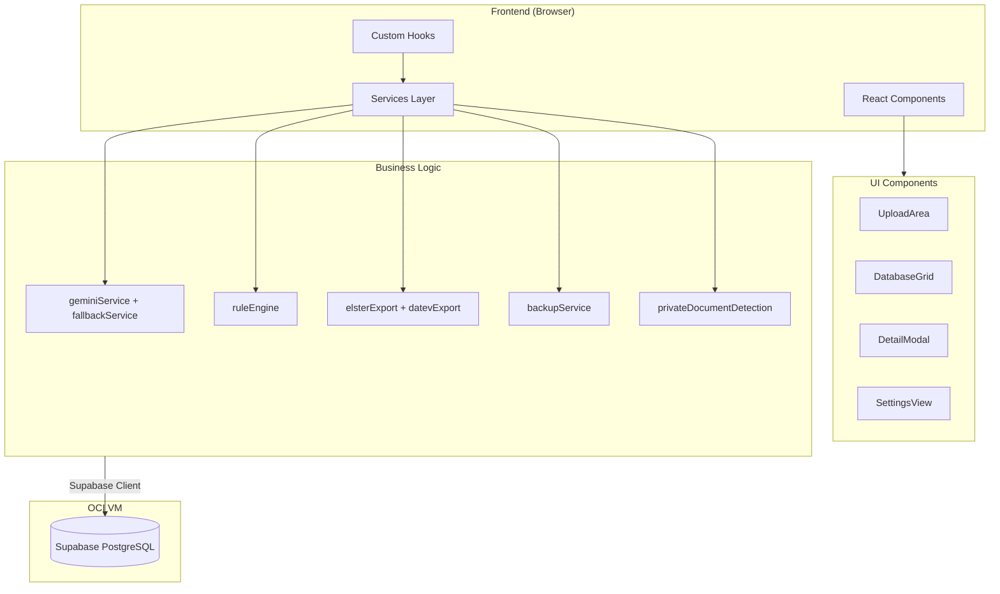
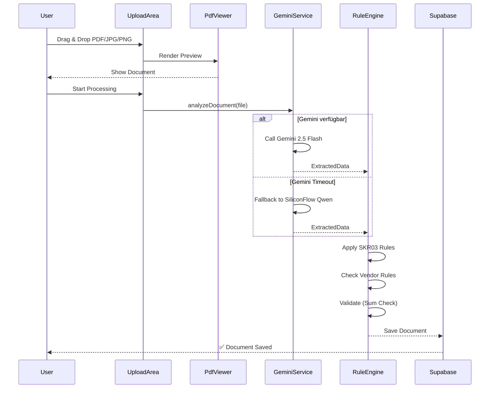

<div align="center">

# ⚡ ZOE Solar Accounting OCR

**Die professionelle Buchhaltungslösung für Solarunternehmen**

[](https://react.dev)
[](https://www.typescriptlang.org)
[](https://tailwindcss.com)
[](https://supabase.com)
[](https://vitejs.dev)
[](https://vitest.dev)

---

### 🤖 KI-gestützt • 🎯 SKR03 • 📊 ELSTER • 💾 DATEV

---

</div>

## Was ist ZOE Solar Accounting OCR?

**ZOE Solar Accounting OCR** ist eine cloud-basierte Buchhaltungsanwendung für Solarunternehmen in Deutschland. Die Software extrahiert automatisch Rechnungsdaten mittels KI, ordnet nach deutschem SKR03-Standard zu und bereitet EÜR/UStVA vor.

> **Architektur:** Cloud-First mit Supabase auf OCI VM (keine lokalen Daten, kein IndexedDB)

---

## 🏗️ Architektur



---

## 🔄 OCR Pipeline



---

## ✨ Features

<div align="center">

| | | |
|:---:|:---:|:---:|
| **🤖 KI-OCR** | **🎯 SKR03** | **📊 ELSTER** |
| Gemini 2.5 Flash + Qwen 2.5 VL | Automatische Kontierung | XML-Export für UStVA |
| | | |
| **💾 DATEV** | **🔐 Cloud-First** | **✅ Qualität** |
| EXTF-Buchungsstapel | Supabase auf OCI VM | 160 Unit Tests |

</div>

### KI-OCR Pipeline

| Modell | Geschwindigkeit | Genauigkeit | Zweck |
|--------|-----------------|-------------|-------|
| **Google Gemini 2.5 Flash** | < 3 Sek | 99% | Primäre Extraktion |
| **SiliconFlow Qwen 2.5 VL (72B)** | < 5 Sek | 98% | Fallback bei Timeout |

**Unterstützte Formate:** PDF, JPG, PNG, WebP

### Kontierungs-Engine

- **SKR03 Standards:** 20 vordefinierte Konten
  - Wareneingang (3400), Büromaterial (4930), Software (4964), etc.
- **Steuerkategorien:** 6 Kategorien
  - 19% Vorsteuer, 7% Vorsteuer, 0% PV, Reverse Charge, Kleinunternehmer, Privatanteil
- **Vendor Rules:** Automatisches Lernen von Lieferanten-Zuordnungen

### Qualitätssicherung

- **Duplikat-Erkennung V2:**
  - **Hard Match:** Belegnummer + Betrag
  - **Fuzzy Match:** Ähnlichkeitsalgorithmus
  - **Hash Check:** SHA-256 Datei-Hashing
- **Validierung:** Netto + MwSt = Brutto (Summenprüfung)

---

## 🛠 Tech Stack

<div align="center">

### Dependencies

| Kategorie | Paket | Version |
|-----------|-------|---------|
| **Framework** | React | ^19.2.3 |
| **Sprache** | TypeScript | ~5.8.2 |
| **Styling** | Tailwind CSS | 4.1.18 |
| **Build** | Vite | ^6.2.0 |
| **AI SDK** | @google/genai | ^1.33.0 |
| **Backend** | @supabase/supabase-js | ^2.89.0 |
| **PDF Engine** | pdfjs-dist | 3.11.174 |
| **PDF Gen** | jspdf | 2.5.1 |
| **Tables** | jspdf-autotable | 3.8.1 |

### Dev Dependencies

| Kategorie | Paket | Version |
|-----------|-------|---------|
| **Test** | vitest | ^4.0.16 |
| **Test Lib** | @testing-library/react | ^16.3.1 |
| **Test DOM** | jsdom | ^27.4.0 |
| **Types** | @types/node | ^22.14.0 |

</div>

---

## 🚀 Schnellstart

```bash
# Repository klonen
git clone https://github.com/Delqhi/ZOE-Solar-Accounting-OCR.git
cd ZOE-Solar-Accounting-OCR

# Abhängigkeiten installieren
npm install

# Umgebungsvariablen konfigurieren
cp .env.example .env

# Entwicklungsserver starten
npm run dev
```

### Umgebungsvariablen

```env
# Supabase (Pflicht)
VITE_SUPABASE_URL=https://deine-supabase-url.oci.oraclecloud.com
VITE_SUPABASE_ANON_KEY=dein-anon-key

# Google Gemini API (optional)
VITE_GEMINI_API_KEY=dein-gemini-key

# SiliconFlow API (optional)
VITE_SILICONFLOW_API_KEY=dein-siliconflow-key
```

---

## 📁 Projektstruktur

```
src/
├── services/                          # Business Logic
│   ├── geminiService.ts               # Google Gemini OCR
│   ├── fallbackService.ts             # SiliconFlow Fallback
│   ├── supabaseService.ts             # Supabase CRUD + Auth
│   ├── ruleEngine.ts                  # SKR03 Kontierung
│   ├── elsterExport.ts                # ELSTER XML
│   ├── datevExport.ts                 # DATEV EXTF
│   ├── datevExtfTemplate.ts           # DATEV Templates
│   ├── backupService.ts               # Backup/Restore
│   ├── privateDocumentDetection.ts    # Privatbeleg-Erkennung
│   ├── exportPreflight.ts             # Export-Validierung
│   └── extractedDataNormalization.ts  # Daten-Normalisierung
│
├── components/                        # React Components
│   ├── DatabaseView.tsx               # Hauptansicht mit Filter
│   ├── DatabaseGrid.tsx               # Sortierbare Dokument-Tabelle
│   ├── DetailModal.tsx                # Split-View Editor
│   ├── DuplicateCompareModal.tsx      # Duplikat-Vergleich
│   ├── UploadArea.tsx                 # Drag & Drop Upload
│   ├── PdfViewer.tsx                  # PDF-Rendering
│   ├── FilterBar.tsx                  # Filter-Leiste
│   ├── SettingsView.tsx               # Einstellungen
│   ├── AuthView.tsx                   # Authentifizierung
│   └── BackupView.tsx                 # Backup/Restore UI
│
├── hooks/                             # Custom Hooks
│   ├── useDocuments.ts                # Document CRUD + Filter
│   ├── useSettings.ts                 # App-Einstellungen
│   └── useUpload.ts                   # Datei-Upload
│
├── App.tsx                            # Main Application
├── index.tsx                          # Entry Point
├── index.html                         # HTML Template
└── types.ts                           # TypeScript Interfaces
```

---

## 📤 Export-Formate

| Format | Beschreibung | Datei |
|--------|-------------|-------|
| **ELSTER XML** | UStVA für Finanzamt | `elster_ustva_{period}.xml` |
| **DATEV EXTF** | Buchungsstapel | `datev_buchungsstapel.csv` |
| **CSV** | Semikolon, UTF-8, 32 Spalten | `zoe_belege_{date}.csv` |
| **SQL** | Vollständiges Schema | `zoe_backup_{date}.sql` |
| **PDF** | Berichte: EÜR, UStVA | `zoe_bericht_{type}.pdf` |
| **JSON** | Backup | `zoe_backup_{date}.json` |

### ELSTER XML Struktur

```xml
<Elster xmlns="http://www.elster.de/2002/XMLSchema">
  <Umsatzsteuervoranmeldung>
    <Jahr>2025</Jahr>
    <Zeitraum>01</Zeitraum> <!-- Q1 oder Monat -->
    <Kz21>steuerfreie Umsätze</Kz21>
    <Kz35>Reverse Charge</Kz35>
    <Kz81>7% Basis</Kz81>
    <Kz83>7% Steuer</Kz83>
    <Kz86>19% Basis</Kz86>
    <Kz89>19% Steuer</Kz89>
    <Kz93>Gesamtsteuer</Kz93>
  </Umsatzsteuervoranmeldung>
</Elster>
```

### DATEV EXTF Format

- **Kontenlänge:** 4-stellig (SKR03)
- **Währung:** EUR
- **Fibu-Schema:** EXTF (externes Format)

---

## 📊 Datenmodell

### ExtractedData Interface

```typescript
interface ExtractedData {
  // Basisdaten
  belegDatum: string;
  belegNummerLieferant: string;
  lieferantName: string;
  lieferantAdresse: string;
  steuernummer?: string;

  // Finanzdaten
  nettoBetrag: number;
  bruttoBetrag: number;
  mwstBetrag19: number;
  mwstBetrag7: number;
  mwstBetrag0: number;
  mwstSatz19: number;
  mwstSatz7: number;
  mwstSatz0: number;

  // Buchhaltung
  kontierungskonto: string;
  sollKonto: string;
  habenKonto: string;
  steuerkategorie: string;

  // Positionen
  lineItems: LineItem[];

  // Qualität
  ocr_score: number;
  ocr_rationale: string;
  textContent?: string;
}

interface LineItem {
  description: string;
  amount: number;
}
```

### DocumentRecord Interface

```typescript
interface DocumentRecord {
  id: string;
  fileName: string;
  fileType: string;
  uploadDate: string;
  status: DocumentStatus;
  data: ExtractedData | null;
  previewUrl: string;
  fileHash?: string;
  duplicateOfId?: string;
  duplicateConfidence?: number;
  duplicateReason?: string;
}

type DocumentStatus =
  | 'pending'
  | 'processing'
  | 'completed'
  | 'duplicate'
  | 'error';
```

---

## 🔌 API Reference

### Services

| Service | Funktion | Export |
|---------|----------|--------|
| `geminiService.ts` | OCR mit Gemini 2.5 Flash | `analyzeDocument(file)` |
| `fallbackService.ts` | SiliconFlow Qwen Fallback | `analyzeDocument(file)` |
| `supabaseService.ts` | CRUD + Auth | `getAllDocuments()`, `saveDocument()` |
| `ruleEngine.ts` | SKR03 Kontierung | `applyRules(data, vendor)` |
| `elsterExport.ts` | ELSTER XML | `generateUstva(docs, settings)` |
| `datevExport.ts` | DATEV EXTF | `generateBuchungsstapel(docs)` |
| `backupService.ts` | Backup/Restore | `createBackup()`, `restoreFromBackup()` |

### React Hooks

| Hook | State | Funktion |
|------|-------|----------|
| `useDocuments()` | `documents`, `loading` | Document CRUD + Pagination |
| `useSettings()` | `settings`, `updateSettings` | App-Einstellungen |
| `useUpload()` | `uploading`, `progress` | Datei-Upload + OCR |

### Custom Components

```tsx
// Hauptansicht mit Filter
<DatabaseView />

// Sortierbare Tabelle
<DatabaseGrid documents={docs} onEdit={handleEdit} />

// Split-View Editor
<DetailModal document={doc} onSave={handleSave} />

// Duplikat-Vergleich
<DuplicateCompareModal original={doc} duplicate={dup} />

// Drag & Drop Upload
<UploadArea onUpload={handleUpload} />

// PDF Rendering
<PdfViewer url={url} scale={1.5} />

// Filter-Leiste
<FilterBar filters={filters} onChange={setFilters} />

// Einstellungen
<SettingsView settings={settings} onSave={saveSettings} />

// Authentifizierung
<AuthView onLogin={login} onLogout={logout} />

// Backup/Restore
<BackupView onBackup={createBackup} onRestore={restore} />
```

---

## 🧪 Testing

| Framework | vitest ^4.0.16 |
|-----------|----------------|
| **Environment** | jsdom |
| **Test-Count** | 160 Unit Tests |
| **Coverage** | 12 Test-Dateien |

### Test-Dateien

| Test | Was getestet wird |
|------|-------------------|
| `ruleEngine.test.ts` | SKR03 Kontierung, Vendor Rules |
| `exportPreflight.test.ts` | Export-Validierung |
| `extractedDataNormalization.test.ts` | Daten-Normalisierung |
| `datevExport.test.ts` | DATEV Format-Generierung |
| `elsterExport.test.ts` | ELSTER XML-Generierung |

### Test-Kommandos

```bash
# Alle Tests ausführen
npm run test

# Watch-Modus
npm run test:watch

# Nur TypeScript checken
npm run typecheck

# Check + Build
npm run check
```

---

## ✅ Roadmap

### Abgeschlossen

| Epic | Feature | Status |
|------|---------|--------|
| **A: OCR & Extraktion** | PDF Upload & Preview | ✅ |
| | Gemini OCR Integration | ✅ |
| | Fallback Pipeline (SiliconFlow) | ✅ |
| **B: Kontierung & Regeln** | SKR03 Mapping | ✅ |
| | Steuerkategorien (6 Kategorien) | ✅ |
| | Vendor Rules Learning | ✅ |
| **C: Qualität & Duplikate** | Duplikat-Erkennung V2 | ✅ |
| | Validierung Engine | ✅ |
| | Private Document Detection | ✅ |
| **D: Export** | ELSTER XML | ✅ |
| | DATEV EXTF | ✅ |
| | CSV/SQL/PDF | ✅ |
| **E: Backend & Sync** | Supabase Integration | ✅ |
| | Auth UI | ✅ |
| | Backup/Restore | ✅ |

### Geplant

| Feature | Priorität |
|---------|-----------|
| KI-gestützte Korrekturvorschläge | Hoch |
| Mobile App (React Native) | Mittel |
| Echtzeit Kollaboration | Niedrig |

---

## 📄 Lizenz

<div align="center">

**© 2025 ZOE Solar GmbH & Co. KG**

*Proprietäre Software - Alle Rechte vorbehalten*

Die Nutzung ist ausschließlich für ZOE Solar gestattet.

---

[📖 Wiki](https://github.com/Delqhi/ZOE-Solar-Accounting-OCR.wiki) • [🐛 Issues](https://github.com/Delqhi/ZOE-Solar-Accounting-OCR/issues) • [📧 Support](mailto:support@zoe-solar.de)

---

*Made with for the Solar Industry* ☀️

</div>
